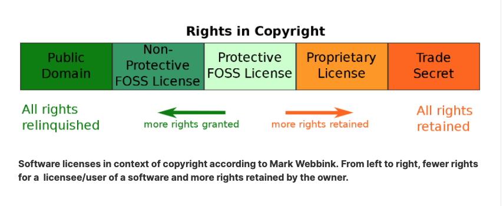
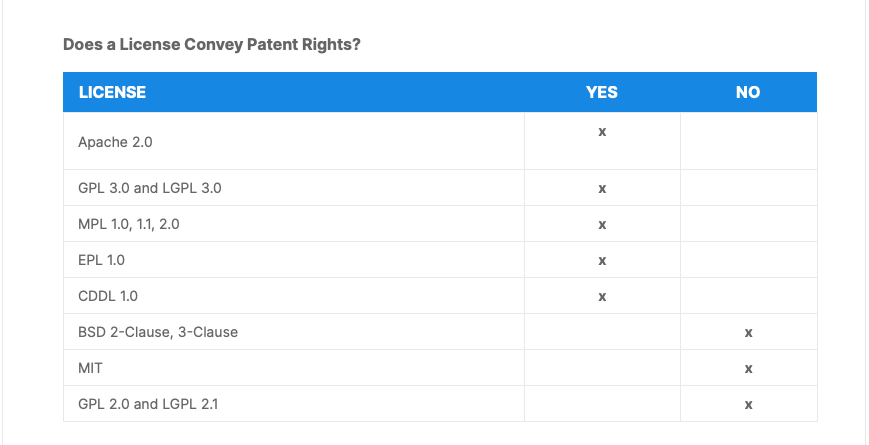

# Notes

## 01. COURSE INTRODUCTION

### Course Information

#### Course Introduction

#### Course Learning Objectives

By the end of this course, you should be able to:

- [ ] 1. List the key concepts involved in developing Open Source Software (OSS).
- [ ] 2. Understand how OSS evolved into today's dominant position.
- [ ] 3. Explain the benefits of using OSS as compared to using proprietary products, and know how to dispel the FUD that arises.
- [ ] 4. Familiarize yourself with open source projects that form the foundations of today's word-wide technology infrastructure.
- [ ] 5. Work with projects that can help you get a solid footing in OSS methods and communities, such as the TODO Group and OpenChain Project.
- [ ] 6. Behave properly while engaging in OSS projects, to develop the best code and build on the strengths of other contributors.
- [ ] 7. Understand OSS licensing issues, such as types (restrictive vs permissive), and explain how to choose the right one.
- [ ] 8. Make use of projects such as FOSSology and SPDX to foster compliance.
- [ ] 9. Have a sense of best practices for long term project sustainability, including how to respect and encourage diversity.
- [ ] 10. Know about GitHub and other hosting providers and advanced interfaces such as Gerrit.

#### Meet Your Instructor: Jerry Cooperstein

Jerry Cooperstein, PhD has been working with Linux since 1994, developing and delivering training in both the kernel and user space. During a two decade career in nuclear astrophysics, he developed state-of-the-art simulation software on many kinds of supercomputers and taught at both the undergraduate and graduate level. Jerry joined The Linux Foundation in 2009. He is currently a Senior Content Manager for The Linux Foundation.

#### Course Audience and Requirements

- [x] 1. Audience: software developers who want to understand the *rules of the road*

- [x] 2. Knowledge/Skills: none prior required

- [x] 3. Software Environment
  - distribution-flexible
  - three main Linux distribution families focused:
    - 1. Debian/Ubuntu
    - 2. Red Hat/Fedora
    - 3. openSUSE/SUSE

- [x] 4. Lab Environment
  - any operating system

### Before You Begin

<https://trainingportal.linuxfoundation.org/learn/course/a-beginners-guide-to-open-source-software-development-lfc102/course-introduction/before-you-begin?page=1>

#### Course Support

One great way to interact with peers taking this course is via the [Class Forum](https://forum.linuxfoundation.org/discussion/863974/introduction-of-myself#latest). The forum can be used in the following ways:

- To introduce yourself to other peers taking this course
- To discuss concepts, tools and technologies presented in this course, or related to the topics discussed in the course materials
- To ask questions or report issues with labs or course content
- To provide solutions/suggestions to peer learners
- To review issues that were already raised, including possible solutions - the forum can be a great learning resource as well, and you may find that your questions have already been - answered in previous posts
- To share resources and ideas related to Linux system administration

Please note that all announcements regarding course updates are posted in the forum, so we highly recommend that you periodically check it out.

If you have questions regarding your course enrollment, you can reach out to us via our [Customer Support system](https://jira.linuxfoundation.org/plugins/servlet/desk/portal/15). You will be required to login with your LF Account, which will help us to quickly locate your account and respond to your request. This will also allow you to track your support request through to resolution, and create an ongoing record of your support requests.

The Linux Foundation Training & Certification Customer Support system also offers enhanced functionality, such as:

- Knowledge Base Articles - to help you find a quick response to your commonly asked questions
- Service Request Forms - asking the right questions so that you can get the right answers.

#### Course Timing

RTR <https://trainingportal.linuxfoundation.org/learn/course/a-beginners-guide-to-open-source-software-development-lfc102/course-introduction/before-you-begin?page=2>

This course is entirely self-paced; there is no fixed schedule for going through the material. You can go through the course at your own pace, and you will always be returned to exactly where you left off when you come back to start a new session. However, we still suggest you avoid long breaks in between periods of work, as learning will be faster and content retention improved.

You have unlimited access to this course for 12 months from the date you registered, even after you have completed the course.

The chapters in the course have been designed to build on one another. It is probably best to work through them in sequence; if you skip or only skim some chapters quickly, you may find there are topics being discussed you have not been exposed to yet. But this is all self-paced, and you can always go back, so you can thread your own path through the material.

#### Lab Exercises and Assessments

The labs and knowledge check questions are not graded.

We would also like to emphasize that you will not be required to take a final exam to complete this course.

#### Lab Exercises

In all The Linux Foundation courses (in any format) we put a heavy emphasis on learning by doing. In live, instructor-led classes, we almost always aim for a 50/50 balance between lecture and discussion, and working on laboratory exercises, or homeworks, that either perform the tasks just described in the class, or try more ambitious variations. Instructors help students figure out how to do things, debug their code and scripts, etc., during these lab sessions. Because this course is self-paced, without a live instructor, it will be up to you to control your time budget and make sure you take enough time to do labs.

📦
For your convenience, you can also access a single file containing all the lab exercises (LFD102 Labs) by navigating to the Table of Contents located on the left-hand side of the screen and selecting Resources > Files.

You will find lab exercises located throughout the course.

#### Knowledge Check

At the end of each chapter, you will also find a series of knowledge check questions. These questions, just like the labs, were designed with one main goal in mind: to help you better comprehend the course content and reinforce what you have learned.

#### Course Formatting

In order to make it easier to distinguish the various types of content in the course, we use the color coding and formats below:

Dark blue: text typed at the command line

Green: Output

Black: file content

Brown: File/Directory names

Light blue: Hyperlink

You may also notice text boxes with different icons. The purpose of each is clarified below:

📦    Additional course documentation

💡    Additional information

🚩    Important information

🔍    Think, explore

📖    External resources

#### Copyright

Copyright 2019-2023, The Linux Foundation. All rights reserved.

### The Linux Foundation

Linux Foundation Projects include:

1. Linux
2. Kubernetes
3. Node.js
4. ONAP
5. PyTorch
6. RISC-V
7. SPDX
8. OpenChain

#### The Linux Foundation (Details)

#### Linux Foundation Events

[Linux Foundation Events](https://events.linuxfoundation.org/)

Over 85,000 open source technologists and leaders worldwide gather at Linux Foundation events annually to share ideas, learn and collaborate. Linux Foundation events are the meeting place of choice for open source maintainers, developers, architects, infrastructure managers, and sysadmins and technologists leading open source program offices, and other critical leadership functions.

These events are the best place to gain visibility within the open source community quickly and advance open source development work by forming connections with the people evaluating and creating the next generation of technology. They provide a forum to share and gain knowledge, help organizations identify software trends early to inform future technology investments, connect employers with talent, and showcase technologies and services to influential open source professionals, media, and analysts around the globe.

#### Linux Foundation Training & Certification

The Linux Foundation Training & Certification Group works with expert instructors and experienced open source developers to create training courses for every level of experience, from complete newbies to veteran developers, as well as certification exams which demonstrate your skills to potential employers in a trusted verifiable way.

To get more information about specific courses and certification exams offered by the Linux Foundation, including technical requirements and other logistics, visit the [Linux Foundation Training and Certification website](https://training.linuxfoundation.org/?_gl=1%2Avjqokh%2A_ga%2AMTQxODI3MDU5LjE2OTUxNDUyNzI.%2A_ga_EMX7DDZMX4%2AMTY5Njg2NTUwNy4xMi4xLjE2OTY4NjcwMTMuNjAuMC4w).

Congratulations!
You've Completed

Course Introduction
Up Next:

Open Source Software (OSS)

## 02. OPEN SOURCE SOFTWARE (OSS)

<https://trainingportal.linuxfoundation.org/learn/course/a-beginners-guide-to-open-source-software-development-lfc102/open-source-software-oss/introduction>

### Introduction

#### Introduction to Open Source Software (OSS)

- [x] watch video

#### Learning Objectives

By the end of this chapter, you should be able to:

- [ ] Define Open Source Software (OSS) and distinguish between different uses of the word free.
- [ ] Explain the differences between proprietary (closed source) and OSS.
- [ ] Discuss the pragmatic and idealist philosophical strains that inhabit the OSS world, and how they conflict, as well as merge.
- [ ] Sketch out the history of OSS as it evolved from the early days of the computer age to its current, widespread, even dominant use.
- [ ] ​Explain and distinguish between different governance models, including Company-Led, Benevolent Dictatorship, and Governing Board.

### What is Open Source Software?

Sharing of software has gone on since the beginnings of the computer age. In fact, not sharing software was the exception, and not the rule. The concepts of Open Source Software (OSS) long predate the use of the term.

There are many models for governance in OSS projects. Each of these models is frequently seen and has its reasons for existence. There is no one method that fits all projects. Contributing to OSS requires learning standard methods and etiquette to do it properly.​

​In English, the word free has two meanings:

- Free as in free speech, freedom to distribute
- Free as in no cost, or, as is often said, as in "free beer".

Use of the term OSS is partly meant to avoid this confusion, but also to better define what is meant.

We are not going to try and give a detailed definition, but just point out some salient facts which we will discuss in more detail.

Use of OSS means source code is made available with a license which provides rights to examine, modify and redistribute, without restriction on the user's identity or purpose.

🚩
There is a multiplicity of licensing methods, falling into the two general classifications:

- Permissive (such as BSD-licensed software)
- Restrictive (such as GPL-licensed software)

#### Proprietary (Closed Source) Software

Proprietary software had historically been the only real model used by commercial projects until the recent rise of OSS.

Only the owners of such software projects have full legal access to the source code involved, although they may grant inspection rights to trusted partners who have signed non-disclosure agreements (NDAs). For this reason, this model is also called closed source.

The owners of proprietary software projects may or may not be the authors of the code; usually, the authors have been working under contracts giving up their individual rights. Indeed, many such programs are no longer even owned by their originators, but have been passed on through sales over time.

To use proprietary software, end users must accept a license restricting their rights, often through a confusing click-through box presented after a very long and dense description during install.

Such licenses generally restrict the user’s rights of re-distribution, indemnify the product from damages due to either malfunction or misuse, and prohibit trying to reconstruct source code or use inside another product. They may sometimes restrict how a product is used, but whether such restrictions are legal will vary with details and legal jurisdictions, including country.

🚩
Price is not the point! The difference with OSS and proprietary models has nothing to do with price. One can charge as much as one wants for an open product and one can provide a proprietary product for free. The license differences have to do with redistribution, modification, reuse of code, etc.

#### Pragmatism vs. Idealism

Since its beginning, OSS has had two different philosophical strains: idealistic and pragmatic.

- Idealistic:
  - Here, free means as in freedom, not beer. There is a profound belief that all software should be open for ideological and ethical reasons, not just technological ones.

- Pragmatic:
  - Here, the primary considerations are technical ones, including faster and better development involving more contributors and review, easier debugging, etc.

Note that the more ideological perspective has strong technical imperatives as well, and in many cases, the objectives of both streams coincide. For example:

- Should the software powering a life-saving medical device (such as a pacemaker, or an insulin pump) be secret? Do we not have the right to know what is controlling such devices? How do we know they are not vulnerable to external attacks that can kill us?
- Should the software powering voting machines be closed? How can we be sure we can respect the integrity of tabulated results? This is particularly true when experiment after experiment has shown closed source voting machines to be incredibly easily hacked.

Unfortunately, the conflicts between these two attitudes towards open source has often been acrimonious and destructive. It is unlikely to ever end; the pragmatic approach has most of the economic resources behind it due to corporate buy-in, and the more philosophical camp will always have determined adherents.

#### History of Open Source Software

Open Source Software (OSS) has a long history, although the actual term only dates back to 1998.

Next, we give a timeline for some of the major developments in the world of OSS. We do not mean to be exhaustive or insult anyone by leaving out important steps, as any list is inherently subjective.

Major OSS Developments

The 1950s and Earlier

    Software arose from researchers, both academic and corporate
    Distributed openly and cooperatively
    Source always distributed, binaries less often
    Software not seen as separate commodity
    Software bundled for free with hardware
    Licensing was sloppy

The 1960s

    Major aspects of computer science and software rapidly developed both in academia (MIT, UC Berkeley) and industrial research labs (Bell Labs, Xerox)
    1968: ARPANET emerges, eventually leads to Internet, essential for developers and researchers to communicate, share, collaborate
    1969: UNIX born at Bell Labs (AT&T) and given for free to universities and research centers
    1969: IBM forced by US government to break software and hardware apart and sell/distribute separately, due to unfair business practices.

The 1970s

    1976: emacs released by Richard Stallman and Guy Steele. Versions by other authors proliferate, including proprietary ones. GNU emacs not released until 1985
    1978: First version of TeX released by Donald Knuth, an open source typesetting system often used for publishing journal articles and books, still in widespread use, usually in the LaTeX version.

The 1980s

    1980: Usenet begins as the ancestor of user forums and the World Wide Web
    1982: GNU project announced by Richard Stallman
    1984: X Window System released out of MIT, with X11 protocol released in 1987 (now run by X.Org)
    1985: Free Software Foundation (FSF) founded by Richard Stallman
    1987: gcc released (now known as Gnu Compiler Collection)
    1987: Perl released by Larry Wall.

The 1990s

    1991: Linux begun by Linus Torvalds
    1992: Python released by Guido Van Rossum
    1992: 386BSD released
    1992: Samba developed by Andrew Tridgell in Australia
    1993: Debian first released by Ian Murdock and still survives as the largest non-commercial Linux distribution
    1993: Red Hat is founded; while earlier commercial Linux distributions already existed, Red Hat was the first company built on open source to become very large
    1993: NetBSD released as a fork from 386BSD
    1993: FreeBSD released
    1993: Wine released to run Windows applications on Linux
    1994: MySQL development begins in Sweden, first release in 1995
    1995: PHP, GIMP, and Ruby released
    1996: Apache web server released
    1996: KDE released
    ​1997: GNOME released
    1998: Netscape open sources its browser, which will later become Firefox
    1999: OpenOffice released (eventually forks into LibreOffice).

The 2000s

    2000: LLVM compiler project begun at UI-Urbana-Champaign
    2002: Blender released as an open source project
    2003: Firefox released
    2004: Ubuntu releases its first version, which Canonical builds on top of Debian
    2005: Git released by Linus Torvalds
    2007: Android released, based on Linux kernel; first devices on the market in 2008
    2008: Chromium released by Google; basis of Google Chrome.

The 2010s

In this decade, OSS becomes ubiquitous, dominating the smartphone market, supercomputing, worldwide networking infrastructure, etc.

#### Open Source Governance Models

There is no shortage of governance models used by OSS projects. They differ according to the degrees of centralization, strong influence by one or a few organizational entities, and existence of democratically-inspired decision mechanisms and leadership selection.

The choice of model and how well it is executed have profound influences on the quality of a project, as well as how quickly it is adopted and evolves, improves and succeeds. There is no one-size-fits-all model and each has its advocates and detractors. Furthermore, different projects have different inherent needs, which may be better satisfied by one particular model.

OSS Governance Models

Company-Led (mostly, a closed process)

    Development is strongly led by one corporate or organizational interest
    One entity controls software design and releases
    May or may not solicit contributions, patches, suggestions, etc.
    Internal discussions and controversies may not be aired very much
    It is not definitively known what will be in the next software release
    Upon release, all software is completely in the open
    Examples: Google Android, Red Hat Enterprise Linux

Benevolent Dictatorship (strong leadership)

    One individual has overriding influence in every decision
    Project's quality depends on that of the dictator
    Can avoid endless discussions and lead to quicker pace
    As project grows, success depends critically on the dictator's ability to:
    - Handle many contributors
    - Use a sane, scalable version control system
    - Appoint and work with subsystem maintainers
    The dictator's role may be social and political, not structural (forks can occur at any time)
    Maintainers write less and less code as projects mature
    Example: Linux kernel

Governing Board (tighter control by smaller groups)

    A body (group) carries out discussions on open mailing lists
    Decisions about design and release dates are made collectively
    Decisions about who can contribute, and how patches and new software are accepted, are made by the governing body
    There is much variation in governing structures, rules of organization, degree of consensus required, etc.
    Tends to release less frequent, but hopefully well-debugged versions
    Examples: FreeBSD, Debian.

### Lab Exercises 2.1

<https://trainingportal.linuxfoundation.org/learn/course/a-beginners-guide-to-open-source-software-development-lfc102/open-source-software-oss/lab-exercises?page=1>

#### Lab 2.1. Basic Facts About OSS

- free in OSS refers to freedom, not cost
- Android by Google is controlled by one entity but still OSS
- OSS predates Linux
- The programming language used is independent of its status as OSS.

#### Lab 2.2. Open Source on Critical Software

- shared knowledge is better than closed knowledge especially with critical software

### Knowledge Check 2

#### Chapter 2 Quiz

Question 2.1

What are the two main types of Open Source Software licenses? Select all answers that apply.

**A. Permissive**
B. Proprietary
C. Free of charge
**D. Restrictive**
E. Educational use

Question 2.2

What is the difference between proprietary software and OSS?

A. Proprietary software can charge and OSS must be free
**B. Proprietary software does not expose its source and OSS does**
C. Proprietary software requires a license and OSS does not
D. Proprietary software pays its developers and OSS does not

Question 2.3

The software for medical devices:

A. Must be open source in most countries, as you have a right to know about your health issues and dangers, etc.
**B. Can be a complete mystery as manufacturers are under no obligation to reveal their code**

Question 2.4

Linux began:

A. In 1998, when IBM made a major investment
**B. In 1991 with an Internet post by a student in Finland**
C. When UNIX was first born, about 1969
D. When SCO ported Xenix to the Intel 8036 processor in 1983

Question 2.5

Which method best describes the way Android is developed?

**A. Company-Led**
B. Benevolent Dictatorship
C. Governing Board

Question 2.6

Which method best describes the way FreeBSD is developed?

A. Company-Led
B. Benevolent Dictatorship
**C. Governing Board**

Question 2.7

Which method best describes the way Linux kernel is developed?

A. Company-Led
**B. Benevolent Dictatorship**
C. Governing Board

RTR

<https://trainingportal.linuxfoundation.org/learn/course/a-beginners-guide-to-open-source-software-development-lfc102/why-use-open-source-software/introduction>

## 03. WHY USE OPEN SOURCE SOFTWARE (OSS)

### Introduction 3.0

#### Introduction to Why Use Open Source Software

- video watched

#### Learning Objectives 3.0

By the end of this chapter, you should be able to:

- Explain the advantages of collaborative development.
- Explain how to obtain flexibility that can give users more options, more possibilities of adaptation, and lower costs while avoiding vendor lock-in.
- Explain how the work of external developers, as well as incorporating suggestions and fixes, can help businesses bring better products to market faster.
- Show how OSS can provide new marketing strategies since customers know what they are getting is part of an entire ecosystem.
​- Understand how both quality and security of code is enhanced by development in the open.
- Enumerate the advantages OSS brings to educational institutions at all levels.
- Explain how OSS gives developers greater visibility and helps them build careers.

### Reasons for Using Open Source Software

#### Collaborative Development

Collaborative development enables software projects to build better software.​

When progress is shared, not everyone has to solve the same problems and make the same mistakes. Thus, progress can be made much faster and costs can be reduced.

Having more eyeballs viewing code and more groups testing leads to stronger and more secure code, as well.

It is often hard for competitors to get used to the idea of sharing, and grasping that the benefits can be greater than the costs. But experience has proved this to be true over and over again.

Competitors can compete on user-facing interfaces (e.g. internal plumbing that everyone needs) so that end users still see plenty of product differentiation and have varying experiences.

#### Security and Quality of Source Code

There are advantages of having freely available source code:

- Code published openly tends to be cleaner because:
  - It is embarrassing to show ugly, sloppy code
  - Coding standards and styles tend to be cleaner and more consistent on community projects
  - More people have to understand and work on the code
- There are more eyeballs examining code and looking for security weaknesses before they are discovered by bad actors
- There is more input in original design to avoid bad ideas​
- No security through obscurity
- No just trust me
- Potentially faster bug repair.

#### OSS Advantages for Various Stakeholders

##### Individual Users

- Flexibility
  - mix and match software
  - save money on buying or leasing software
  - avoid vendor lock-in, maintaining choice
  - look under the hood ("trust, but verify")
  - more fun!

##### Businesses

- Collaborative Development
  - lowers total cost of development
  - speeds up time to market
  - work is submitted to wider community for critique, suggestions and contributions
  - upstreaming reduces future costs for new products that reuse code
  - uses well-delineated APIs

- Marketing
  - customers know what they are getting - have confidence in quality as there are no secrets
  - product is seen as part of a large ecosystem of related products
  - more flexible, possibly modular construction
  - Adoption by larger community can help build customers' confidence about the products durability and stability

##### Education

- Childhood Education (Public Systems)
  - large amount of available teaching resources at little or no cost
  - wide range of areas available for using, operating and system administration, and programming
  - students do not become locked into vendor products
  - school systems do not have to pay for expensive software, even at a discount
  - generally lower hardware costs, and easier to use old hardware
  - students learn the skills they need in the workforce
  - unleashes student creativity, and is more fun!

- University (all the advantages of earlier education and more)
  - students can study and work on the internals of operating systems, applications and libraries, and system administration utilities
  - students are ready to enter the workforce where they are most needed
  - good habits are developed, including how to work with the open source community
  - student work is easy for prospective employers to evaluate, sentence, publicly accessible

- Developers
  - no need to invent (reinvent anything)
  - helps to make good, early decisions on product design
  - more eyeballs on code can fix bugs faster
  - suggestions and contributions are provided by large group of developers
  - Great for finding the next job
    - code is readily available for evaluation
    - can demonstrate how well you work and play with others
    - can show how good you are at mentoring and maintaining projects and subprojects
    - know you are not alone!

### Lab Exercises 3.0

Lab 3.1. Using OSS Methods to Produce Better Products

Exercise 3.1: How OSS Methods Can Produce a Better Product

Enumerate a few reasons how adopting OSS methods can improve and accelerate a product’s success.

Solution 3.1

1. Expanding the pool of collaborators brings in more talent, more ideas.
2. Competing groups become collaborators and do not have to keep reinventing the wheel. By standardizing on one implementation and building upon it, progress can be faster.
3. More eyeballs on the code leads to more bug and security hole discovery as well as faster fixes.
4. More eyeballs on the code leads to improved and cleaner style.   Furthermore,  having style standards throughout a project leads to increased clarity and lessens the path to involvement by new contributors.
5. Getting recognition from a wider audience motivates people.
6. Having a wider variety of use cases induces a project to have more flexibility and also helps unearth problems that might be rarer and harder to identify with a smaller audience.

### Knowledge Check 3.0

Chapter 3 Quiz

Question 3.1

From a business perspective, use of OSS (Select all answers that apply):

Correct Answer

A. Lengthens time to market, but is worth it because of improved product
B. Enables use of ingredients from other sources and speeds development Your Answer: Correct
C. Makes marketing more difficult because it is hard to differentiate products
D. Makes marketing easier, as some ingredients are already well-known and trusted Your Answer: Correct

Question 3.2

For school systems at any level, use of OSS (Select all answers that apply):

Correct Answer

A. Should be avoided, as students become confused by choices
B. Can lower costs by letting low-cost or free software be used Your Answer: Correct
C. Can lower costs by letting older hardware be used Your Answer: Correct
D. May cause problems with vendor lock-in

Question 3.3

OSS is (Select all answers that apply):

Correct Answer

A. Insecure, as bad actors can easily see the code and hack it
B. Secure, because many developers can easily see the code, look for problems, and mitigate problems when they are discovered Your Answer: Correct
C. Causing security problems, because developers come from different organizations and companies and do not understand each other's code
D. Insecure, because no one is in charge of security
E. Secure or insecure, depending on the quality and priorities of the project maintainers, but at least users can judge this by open discussion and code inspection Your Answer: Correct

QUIZ RESULTS
YOU GOT 3 OUT OF 3 CORRECT: 100%

3 3 3 0

TOTAL (3)
ANSWERED 3
CORRECT 3
INCORRECT 0

RTR

## 04. EXAMPLES OF SUCCESSFUL OSS PROJECTS

<https://trainingportal.linuxfoundation.org/learn/course/a-beginners-guide-to-open-source-software-development-lfc102/examples-of-successful-oss-projects/introduction?page=1>

### Introduction 04

#### Introduction to Examples of Successful OSS Projects

OSS ecosystems dominate almost all of the major ingredients in the world’s technology infrastructure. In this section, we will just survey a few of the most widely used and/or recognizable ones. We do not mean to slight those not specifically mentioned here, as a full list would be extremely long and actually impossible to accurately compile.

#### Learning Objectives 04

By the end of this chapter, you should be able to enumerate and briefly discuss successful OSS projects, including:

- Linux kernel
- Git
- Apache
- Python, Perl and other computer languages
- TeX and LaTeX
- GNU: gcc, gdb, etc.
- X and desktop managers
- OpenStack, Kubernetes and other projects.

### Successful OSS Projects: Examples

### Linux Kernel

The Linux kernel has been an open source project since its inception in 1991. It is the basis of almost all of the world’s computing infrastructure, from the most powerful supercomputers to the largest number of mobile devices, based on Android, built on a Linux kernel.

The Linux kernel has become ubiquitous in an enormous range of devices and embedded products, from personal fitness devices such as FitBit, to almost all DVR boxes and televisions, to many automotive systems, to in-flight entertainment systems, to medical devices; the list is infinite.

The kernel development community is large and mature. While still headed by its founder, Linus Torvalds, there is a well-formed organizational structure of subsystem maintainers and mailing lists, contributor guidelines and methods, many world-wide conferences every year where developers can get to know each other and work in person, etc.

The pace of the kernel development is rather astounding, and a new version is put out every 10-12 weeks; take a look at The Linux Kernel Archives to see the latest information. Literally thousands of developers (most of whom work for hardware and software companies, as well as for industrial collaborative consortia) are actively engaged in advancing the new releases.

The Linux kernel is released under GPL Version 2; there are some sections that have dual licensing, with other open source licenses. For more details, read GNU General Public License, Version 2.

### Git

Git is a distributed version control system that is used worldwide for an astounding number of collaborative products.

Git was created by Linus Torvalds in 2005 to handle the increasingly difficult task of coordinating and consolidating the work of thousands of contributors to the Linux kernel. Many others have continued to develop Git, which has Junio Hamano as its long time maintainer.

While there have been version control systems in existence as long as people have worked together, Git is unparalleled in its ability to handle widely dispersed individuals over the Internet.

It is also the basis of GitHub, which hosts more than one hundred million of open source projects repositories; GitLab, another easily available host, handles quite a few projects as well. Most of these OSS projects actually fail, but having a freely available (and zero cost in most instances) home for these projects has enabled easy startup and a straightforward path to scaling to larger communities.

Like many other tools (such as compilers and debuggers), Git can be used in non-open source projects as well; this in no way contaminates using it for OSS work.

### Apache

Work on the Apache HTTP Server began in 1995. Today, it is the most widely used web server, with roughly one third of the market share. Another open source project, nginx, has almost as many users. It operates under the umbrella of the Apache Software Foundation (ASF), while the server can be found at the Apache HTTP Server Project website. It is hard to overestimate the importance of Apache; there are many related projects that permeate the entire international technical space. Apache is released under the Apache Software License, which has also been adopted by many other projects. It is more permissive than the GPL, as we will discuss later.

### Python, Perl and Other Computer Languages

Perl, Python, Ruby, GNU Compiler Collection (GNU), LLVM compiler infrastructure project, Rust

Each of these has somewhat different licensing situations. However, the license does not extend to programs or libraries, or any other product developed using the language. In quite a few cases, the language standards may be set by some kind of standards body, but there can be multiple implementations, some OSS, some not, such as the case with C++. Or, the language can be more closed (such as C# or Java) in terms of accepting contributions from beyond a single entity, such as a corporation or committee.

### Tex and Latex

TeX is really a typesetting system rather than a word processor program, and was developed from the outset to work on any kind of hardware imaginable. LaTeX, short for Lamport TeX, is a document preparation system.

TeX was invented by Donald Knuth and first released in 1978. Knuth is an extremely influential computer scientist widely recognized for his wide-ranging contributions, in particular to algorithm analysis and development. TeX is really a typesetting system rather than a word processor program, and was developed from the outset to work on any kind of hardware imaginable.

LaTeX, short for Lamport TeX, is a document preparation system widely used especially in academia for communication and publication of scientific documents in many fields , such as mathematics, computer science, engineering, physics, linguistics, philosophy, etc. It was created by Leslie Lamport in 1983. LaTeX is intended to provide a high-level, descriptive markup language that leverages the power of TeX in an easier way for writers. Essentially, TeX handles the layout side, while LaTeX handles the content side for document processing.

Most users of TeX use higher level versions, such as LaTeX, which are more user-friendly, and, in turn may have multiple implementations; the most popular LaTeX version is texlive.

Note that input is in plain text, rather than the WYSIWG scenario you have in popular office suites, and mark up tags and macros control the final appearance of the output.

Given its provenance, TeX was first widely adopted by mathematicians and a specialized version, amstex was used, and later AMS-LaTeX. To date, there is simply no other system which can render mathematical formulae and equations as well at TeX. From there, TeX and then LaTeX rapidly spread through academia, where it is still the dominant form in many science disciplines, and is also used in many other places. There are specialized versions or additions to make LaTeX work with a wide variety of languages, and there are also extensions for embedding it in other applications and computing languages and vice versa, as well as WYSIWYG versions that some find easier to use. And all has always been under an open source license.

### GNU: gcc, gdb, and More

The GNU Project has provided many essential ingredients for virtually all modern computer technologies, under various versions of the GPL (General Public License). It was started in 1983 by Richard Stallman. Its name stands for Gnu’s Not Unix. It is very closely related to the Free Software Foundation (FSF).

GNU Projects

- gcc
  - The GNU Compiler Collection (GCC) is a compiler system produced by the GNU Project supporting various programming languages. It's a compiler for C, C++, Objective C and other high level languages.

- gdb
  - The GNU Debugger is a portable debugger that runs on many Unix-like systems and works for many programming languages, including Ada, C, C++, Objective-C, Free Pascal, Fortran, Go and partially others.

- glibc
  - The GNU C Library, commonly known as glibc, is the GNU Project's implementation of the C standard library. It is the most fundamental and widely used program library. Many other libraries are closely related to it.

- bash
  - GNU Bash or Bash is a Unix shell and command language used widely as the default login shell for most Linux distributions. It is the most common command line shell.

- coreutils
  - The GNU Core Utilities or coreutils is a package of GNU software containing reimplementations for many of the basic tools, such as cat, ls, and rm, which are used on Unix-like operating systems.

GNU tools such as gcc and gdb were essential to the development of Linux from its earliest stages. The adoption of the GPL was absolutely essential to the success of the Linux kernel and the rise of operating system distributions based on it.

### X and Desktop Managers

There are a number of ingredients that are used to instantiate the graphical desktop interface seen on any Linux laptop or workstation, including:

- X Window System
  - The underlying software that handles basic screen, input device and other point operations. A newer and more secure alternative, Wayland, is moving into its current role.

- GNOME, KDE, XFCE
  - Desktop Manager frameworks that control the operation of graphical interfaces, drag and drop between them, appearance of the desktop, etc.

All of these are distributed and developed under commonly used open source licenses.

There are many other desktop manager alternatives used in specialized distributions and embedded devices.

### OpenStack, Kubernetes and Other OSS Projects

There are many other large scale (as well as small) collaborative projects that are based on open source software. A few critical examples:

- OpenStack: the most widely deployed open source cloud software in the world
- Kubernetes: also known as K8s, is an open-source system for automating deployment, scaling, and management of containerized applications.
- ONAP: Open Network Automation Platform
- Hyperledger: The open source, global ecosystem for enterprise-grade blockchain technologies that are at the core of critical developments and implementations around the world
- Node.js: Node.js® is an open-source, cross-platform JavaScript runtime environment.
- Xen: THE MISSION OF THE XEN PROJECT IS TO ADVANCE VIRTUALIZATION TECHNOLOGY ACROSS A WIDE RANGE OF COMMERCIAL AND OPEN-SOURCE DOMAINS.
BY PROVIDING A POWERFUL AND VERSATILE HYPERVISOR, THE PROJECT AIMS TO ENABLE INNOVATION, SCALABILITY, SAFETY, AND SECURITY IN VIRTUALIZATION SOLUTIONS.
- Core Infrastructure Initiative: The Core Infrastructure Initiative (CII) was an effort to improve the security of open-source software.
- Automotive Grade Linux: Automotive Grade Linux is a collaborative open source project that is bringing together automakers, suppliers and technology companies to accelerate the development and adoption of a fully open software stack for the connected car. With Linux at its core, AGL is developing an open platform from the ground up that can serve as the de facto industry standard to enable rapid development of new features and technologies.

### Lab Exercises 04

#### Lab 4.1. What OSS Products Do You Use?

- Node.js
- PostgreSQL

Solution 4.1

1. Android: Used in the majority of smart phones and other mobile devices world wide, built on top of the Linux kernel
2. Apache Web Server (httpd): About half of all web servers are running Apache and its related products.
3. Social Media: Virtually all social media platforms (Facebook, Twitter, Instagram etc.) are using OSScomponents throughout.
4. Search Engines: GOOGLE and other search engines have vast data farms running Linux.
5. Weather Forecasting: Essentially 100 percent of the world’s supercomputers run Linux, and forecasting the weather is one of the most intensive uses.
6. Personal Fitness Devices: IncludingFitBit.
7. DVRs: Almost all set top boxes and video recorders run Linux
8. Medical Devices: A large number of medical devices used routinely every day are running Embedded Linux.

All these projects make extensive use of OSS tooling, such as gcc, make, glibc and languages such as Python, Perl and Ruby.

### Knowledge Check 04

#### Chapter 4 Quiz

QUIZ RESULTS
YOU GOT 3 OUT OF 3 CORRECT: 100%

Question 4.1

The git version control system arose from needs of which project?

A. Apache
B. The Linux kernel Your Answer: Correct
C. Kubernetes
D. Python
E. GNU

Question 4.2

Which of the following are OSS projects used to construct a graphical interface? Select all answers that apply.

A. X Window System Your Answer: Correct
B. Microsoft Windows
C. GNOME Your Answer: Correct
D. Wayland Your Answer: Correct
E. KDE Your Answer: Correct

Question 4.3

Which of the following are projects emanating from the Free Software Foundation? Select all answers that apply.

A. gcc Your Answer: Correct
B. bash Your Answer: Correct
C. gdb Your Answer: Correct
D. Apache
E. glibc Your Answer: Correct

<https://trainingportal.linuxfoundation.org/learn/course/a-beginners-guide-to-open-source-software-development-lfc102/developing-an-oss-strategy/introduction>

## 05. DEVELOPING AN OSS STRATEGY

### Introduction 05

#### Introduction to Developing an OSS Strategy

- video introduction

#### Learning Objectives 05

By the end of this chapter, you should be able to:

1. Understand the importance of constructing a coherent open source strategy for your organization.
2. Explain the strategic considerations involved.
3. Discuss the factors involved in designing an effective open source program office.
4. Sketch out the ingredients used in the design.
5. Plan the implementation of the strategic policy.

### How to Develop an OSS Strategy

#### Constructing an Open Source Strategy

No engineer would construct a bridge or highway without a design and specifications, and no military would enter a war without planning.

However, OSS is entered into many environments without clear conscious strategies. There are many cases where engineers and system administrators began to adopt it simply because it was better and/or easier to fix, and even hoped that those above them in the food chain would not notice, e.g. there are many examples of a Linux print or email server being snuck into the office so the IT staff would need to come in less on weekends to fix breakage more common on other operating systems.

Using administrative tools without careful consideration of licensing requirements is less likely to run into potential problems than using code during development. Sloppiness, however, can lead to a host of problems if anything is distributed outside the shop, even if there are no modifications made, depending on the particular licensing involved.

Nowadays, use of OSS has become ubiquitous and even shops that were virulently opposed to its use are now heavily invested in it, with the best known example being Microsoft. Thus, a well-thought-out and implemented strategy for OSS use and adoption is not a luxury, it is a basic building block essential for success.

#### Strategic Considerations

Key considerations involved in developing a strategy for integrating open source into an organizational and business framework have been well summarized in the article [Open Strategizing: Key Considerations for an Open Source Strategy by](https://web.archive.org/web/20200930091831/https://resources.whitesourcesoftware.com/blog-whitesource/open-strategizing-key-considerations-for-an-open-source-strategy) Anat Richter.

The three main sequential steps listed by Anat Richter:

1. Establishing an Open Source Office
   1. This cannot be an afterthought. Someone has to be in charge and aware of all considerations.

2. Formulating an Open Source Policy
   1. This will depend on the current situation, needs, and future plans.

3. Implementing an Open Source Policy
   1. This can be tricky, but good planning helps a lot.

#### Open Source Program Office

The open source program office serves as a center for functions, including:

- Choosing OSS code to be used
- Facilitating adoption of the code and popularizing its availability and usage
- Keeping track of usage
- Auditing compliance considerations
- Making sure proper information and training is available to all employees, as needed

One of the first tasks is to determine the placement of such an office within the organization. It should be relatively high in the organizational chart. Such an office may reside in the research and development command structure, or it may be placed under the legal department. There is no one answer for this choice of placement, but whomever is responsible must be sensitive to both the developer and legal needs. Otherwise, impedance mismatches will only grow and cause trouble down the road.

#### Designing an Open Source Policy

Perhaps the first step in open source policy construction is to ascertain how much of your product is already using open source components and how large an achievable goal can be. It is highly common for successful projects to be built of more than half OSS, and fractions of the code base that are OSS as high as 90 percent are not unusual. When done properly, it may even be just the upper crust of a product, the customer facing user interface that contains private code, and even that interface may be built entirely on OSS components. The value added can be in the integration of the components rather than the components themselves.

Some key considerations:

- How much of the product is desired to be OSS? Are there current closed source components which could be replaced by open source ones, perhaps both improving the product and its forward maintenance?
- Which license(s) are a good fit to your needs and which licenses can you use in various OSS components you integrate, such as libraries, APIs, etc.? Are you best off with permissive licenses (like BSD or Apache) or more restrictive ones (like GPL)? Can you mix them in one or more released products?
- Do you have a strong enough understanding (and legal help) to set up procedures for using both proprietary and open source code in a way which protects both types?
- How will you review the code to make sure things are being done properly, that inappropriately licensed material does not find its way into your code, both the open and closed parts? Will you use automated license compliance tools, such as [FOSSology](https://www.fossology.org), [SPDX](https://spdx.dev/use/tools/), or [FOSS Bar Code Tracker](https://github.com/linuxfoundation/foss-barcode/).

​A good starting point would be to check the [Linux Foundation's Open Compliance Program](https://compliance.linuxfoundation.org/references/tools/). Security considerations should be built in from the beginning. There will be OSS components that are generally assumed to be of high quality in this regard, with strong and prompt action when security problems are uncovered. Someone will be directly responsible for auditing and approving the secure nature of all incorporated OSS. Disclosure requirements mean that you have to be able to report to any interested client or user information about all OSS components, including information such as the original upstream source, the version, licensing considerations and dependencies. This is the same information you want about any components you include, i.e. you may be someone else’s upstream.

#### Implementing an Open Source Policy

A policy is worthless without both a structure for ensuring implementation, and having a dedicated staff tasked with carrying it out. Training will need to be developed (or outsourced), targeted to more than one staff element, including:

- Developers
- Procurement
- Legal
- Security

Community participation and outreach can also be critical. Who are designated spokespeople? Who monitors developer participation and contributions? Specific procedures will have to be developed for (often automated) code inspection of any incorporated elements for license compliance, etc. Clear assignment of responsibility is required in all areas.

### Knowledge Check 05

#### Chapter 5 Quiz

Question 5.1

Establishing an open source office and implementation plans:

Correct Answer: B

A. Should be done once your organization has some good OSS experience under its belt. Otherwise, a lot of work may be wasted and adoption of OSS delayed while time is wasted debating plans that may never be needed and issues that will not be of any concern.

B. Should be done from the outset, before bad practices and sloppy code usage gets baked in and is hard to fix later, and to give a guide for developers and planners on how to incorporate OSS early in their engineering work.

Your Answer: Correct

QUIZ RESULTS
YOU GOT 1 OUT OF 1 CORRECT: 100%

## The TODO Group Lesson 06

<https://trainingportal.linuxfoundation.org/learn/course/a-beginners-guide-to-open-source-software-development-lfc102/the-todo-group/introduction>

### Introduction 6

#### Introduction to The TODO Group

- watched video

### Learning Objectives 06

By the end of this chapter, you should be able to:

- Explain the mission of the TODO Group.
- Understand the importance of spreading success stories in using OSS to new venues and organizations.
- List reasons why codifying goals and practices makes OSS adoption easier and faster.

### About the TODO Group

#### About the TODO Group Details

The [TODO Group](https://todogroup.org) was founded in 2014 with the express mission of fostering the adoption and spread of open source software in the corporate business community. Founding members included: Box, Dropbox, Facebook, GitHub, Google, HPE, Khan Academy, Microsoft, Square, Stripe, Twitter, Walmart and Yahoo. A full list of members is available at the project's website.

Some of the TODO Group Members
Retrieved from the [TODO Group website](https://todogroup.org/about/members/)

TODO is a open community of practitioners who aims to create and share knowledge about Open Source Program Offices or similar Open Source initiatives. TODO Group community is open to all and is formed by its Community participants (including OSPO Associates) and General Members. TODO Group Community is open to all. Usually, practitioners coming from an organization with an OSPO or an established strategy and policies around Open Source / FOSS efforts within its organization support TODO by becoming General Members. Our General Members include: TODO Group Member Products/Projects (96). The TODO Group became a Linux Foundation collaborative project in March 2016.

### Purposes of the TODO Group

Every industry today uses and relies on OSS. It is virtually impossible to build a successful business model that fails to incorporate open source components at multiple levels. However, there still exist gaps in taking advantage of the full capabilities available, and in organizational comprehension of the essential concepts and necessary practical methods and considerations. Many corporations and other organizations have faced the task of appreciating and incorporating OSS methods, and the members of the TODO Group have united to share their experiences so as to help each other surmount the challenges involved. Besides easing individual members to accomplish their goals effectively, sharing helps develop a fertile ecosystem that enables organizations to work cooperatively and speak the same language, helping to develop partnerships and make deals, etc.

🚩
Note that most members of the TODO Group do not have OSS as their central mission (as do companies such as commercial Linux distributions like Red Hat, SUSE or GitHub), but they employ OSS in the essential parts of their products as well as their infrastructure.

The TODO Group focuses on:

- Sharing best practices for running large open source programs.
- Codifying goals for successfully managed projects.
- Spreading knowledge about helpful tooling and instrumentation.
- Listing and describing member projects that are successful examples.

Every organization has its own unique set of needs, challenges and practices. Sharing allows for faster and better establishment of enabling open source strategies.

### TODO Guides

The TODO Group and the Linux Foundation have made available a series of [guides](https://todogroup.org/resources/guides/) that publicize best practices gained from the experience of companies that use and develop OSS.

#### Guides on building a successful open source program

- How to create an open source program office
- Measuring your open source program's success
- Tools for managing open source programs

#### Guides for open source program management

- Using open source code
- Participating in open source communities
- Recruiting open source developers
- Starting an open source project
- Open source reading list
- Improve your open source development impact
- Shutting down an open source project
- Building leadership in an open source community
- Setting an open source strategy

[TODO Guides Links](https://trainingportal.linuxfoundation.org/learn/course/a-beginners-guide-to-open-source-software-development-lfc102/the-todo-group/about-the-todo-group?page=3)

### TODO Case Studies

<https://trainingportal.linuxfoundation.org/learn/course/a-beginners-guide-to-open-source-software-development-lfc102/the-todo-group/about-the-todo-group?page=4>

The TODO Group has also published a series of case studies by a diverse group of companies, that describe how they adopted and manage open source into their corporate DNA:

- Autodesk
- Capital One
- Comcast
- Dropbox
- Meta
- Microsoft
- Oath
- Porsche
- Red Hat
- Rit
- Salesforce
- SAP
- Uber

### Lab Exercises 6

#### Lab 6.1. TODO Case Studies

The best way to learn about how companies have successfully incorporated OSS into their DNA is to read some the case studies we listed previously. You will notice the companies range from those built on and around OSS (like Red Hat) to those in other industries, such as Capital One in the financial sector, Comcast in telecommunications and entertainment, and general business products, such as SAP and Salesforce. Pick whatever interests you and learn about those experiences.

### Knowledge Check 06

#### Chapter 6 Quiz

Question 6.1

The TODO Group:

Correct Answer

A. Operates under the auspices of the Free Software Foundation (FSF) and GNU
**B. Is a project under the umbrella of the Linux Foundation Your Answer: Correct**
C. Is run by the OpenStack Foundation
D. Is a joint project of the UK's MI6 and Russia's FSB, and consults with the CSA and NSA as needed

THE TODO GROUP
Knowledge Check
QUIZ RESULTS
YOU GOT 1 OUT OF 1 CORRECT: 100%

1 1 1 0
TOTAL (1)
ANSWERED
CORRECT
INCORRECT

## 07. THE OPENCHAIN PROJECT

### Introduction 07

#### Introduction to The OpenChain Project

- watch video
- OpenChain is a Linux Foundation project
- certification process

#### Learning Objectives 07

By the end of this chapter, you should be able to:

- Explain the role of the OpenChain Project in elucidating and sharing the ingredients in successful open source compliance programs.
- Discuss the requirements that must be satisfied to receive the OpenChain Conforming certification and the right to display the logo.
- List the compliance artifacts that are incorporated in these requirements.

### About the OpenChain Project

#### What Is The OpenChain Project?

The [OpenChain Project](https://www.openchainproject.org) is tasked with identifying and sharing the components of high quality open source compliance programs. It is a Linux Foundation project that was born in 2013 out of the recognition that many organizations had adopted open source software components, and had developed license compliance programs. While there was considerable overlap in methods and quality, there were insufficient methods of establishing trust in the quality and consistency of software being shared and exchanged.

The OpenChain Project established an open set of requirements for effective management of **free and open source software (FOSS)**. If an organization meets this [specification of requirements](https://www.openchainproject.org/get-started), it can be certified as OpenChain Conforming and receive the right to display the logo indicating that it is fully compliant. The most current version of the Specification can be accessed [here](https://www.openchainproject.org/get-started).

Please note that the distributed ledger technology Openchain is not related to this project.

OpenChain Project Members
Retrieved from the OpenChain Project Members web page (404)

#### Compliance Program Requirements

There are [six main categories required for a compliance program](https://www.openchainproject.org/resources/faq):

1. Know Your Free and Open Source (FOSS) Responsibilities [i.e., “Policy and Training”]
2. Assign Responsibility for Achieving Compliance
3. Deliver FOSS Content Documentation and Artifacts
4. Review and approve FOSS content
5. Understand FOSS Community Engagement
6. Certify Adherence to OpenChain Requirements

It is important to note that the OpenChain Specification does not indicate compliance with any particular open source license; it describes the level of trust that an organization has built a program that establishes license compliance.

Such a program will have compliance artifacts, including:

- Source code
- Build scripts
- License copies
- Attribution notices
- Modification notices
- SPDX data
- Any other materials licenses may require in a deliverable.

#### Certification

<https://trainingportal.linuxfoundation.org/learn/course/a-beginners-guide-to-open-source-software-development-lfc102/the-openchain-project/about-the-openchain-project?page=3>

OpenChain Conformance can be established online through a [self-certification process](https://www.openchainproject.org/get-started). It is as simple as answering a series of questions. A step by step video showing the process can be viewed on YouTube: [OpenChain Self-Certification](https://www.youtube.com/watch?v=EAUAr9S8Ipk).

There is also [detailed documentation available on how to achieve conformance](https://www.openchainproject.org/get-started), including guides for best practices for compliance, engineering and reuse, as well as checklists for compliance and conformance. There are also tooling overviews guidance for establishing proper workflows.

Successful certification lets an entity use the OpenChain logo.

OpenChain Conformance Logos

Below is a [figure showing an example enterprise process flow](https://www.openchainproject.org/get-started):

End-to-End Compliance Management: Enterprise Process Example

### Lab Exercises 07

#### Lab 7.1. OpenChain Self-Certification

Exercise 7.1: OpenChain Self-Certification

As noted, an organization can undergo a self-certification process at <https://www.openchainproject.org/conformance.Watch> the video at <https://youtu.be/EAUAr9S8Ipk> to get a sense of how to earn the use of the **OpenChain Conformance** logo.

[OpenChain Self Certification](https://youtu.be/EAUAr9S8Ipk)

### Knowledge Check 07

#### Chapter 7 Quiz

Question 7.1

The OpenChain Project:

Correct Answer

A. Operates under the auspices of the Free Software Foundation (FSF) and GNU
B. Is a project under the umbrella of the Linux Foundation Your Answer: Correct
C. Is run by the OpenStack Foundation
D. Is a joint project of the UK's MI6 and Russia's FSB, and consults with the CSA and NSA as needed

THE OPENCHAIN PROJECT
Knowledge Check
QUIZ RESULTS
YOU GOT 1 OUT OF 1 CORRECT: 100%

1 1 1 0
TOTAL (1)
ANSWERED
CORRECT
INCORRECT

<https://trainingportal.linuxfoundation.org/learn/course/a-beginners-guide-to-open-source-software-development-lfc102/how-to-work-in-oss-projects/introduction>

## 08. HOW TO WORK IN OSS PROJECTS

### Introduction 08

#### Introduction to How to Work in OSS Projects

- watched video

#### Learning Objectives 08

By the end of this chapter, you should be able to:

- Know what resources are available to ease entrance into an OSS project community.
- Start off by studying how the community works and deciding what it is you want to contribute and why.
- Identify maintainers and understand their methods and proper workflow.
- Learn how to get constructive input for your contribution and how to work in the open.
- Develop best strategies for how often to contribute and in what size pieces.
- Work on the human interaction skills necessary to work with other members of the community, especially those who may be difficult.
- Strive to develop long-term relationships and really join the community.

### Working in OSS Projects

#### How to Contribute Properly

Before making contributions to any OSS project, you should investigate it, understand its workflow and style, and identify the scope and nature of your work: 🔍

- Identify how the project communicates; start by reading the mailing list for the project. Also, study any existing archives.
- ​If there is an Internet Relay Chat (IRC) network, join it.​
- Understand how contributions are submitted. Is it through mailing lists? Email? A revision control system, such as git or subversion? A good way to lessen your standing on the project - is to be sloppy or ignorant of proper procedures, including even trivial sounding matters like using an email client that does not mess up white space.
- Study previous history. Has your idea been considered before and rejected? Or, if generally seen as worthwhile, is there already an individual or group working on the idea? If so, you - should join them in many cases, not start over.
- Does the project offer veteran contributors as mentors?

Rather than beginning by submitting code, it is often far better to offer your services for testing, finding bugs, and similar work. Many open source projects complain that this is their weakest link.​ Make sure you are competent at whatever programming or scripting language the project uses; developers will be impatient in correcting your code on that level. Find the right balance between asking for suggestions and review early in the process, instead of waiting too long and dumping a lot of perhaps poorly conceived work on people at once. No one enjoys contributors who pontificate all the time without contributing code, and no one likes massive patch sets that cannot be absorbed easily. Finally, please be polite, respectful, avoid obscenities, flaming and trolling. While some communities tolerate it, it should not be encouraged, as it affects the quality of work and it is just wrong.

#### Contributing to OSS Projects

When contributing to OSS projects, you must keep in mind various things, to ensure you abide by the rules of the project and its community.

##### Things to Consider When Contributing to OSS Projects

###### Know Where the Code is Coming From: DCO and CLA

It is very important for any open source project to document and understand where all contributed code is coming from. This is important for multiple reasons, including:

- Knowing who the expert(s) are on the contributions; when there are questions or modifications, generally these people need to either answer them or do the work, or at least review it before acceptance.
- Knowing the legal provenance of the code; if someone either inadvertently or intentionally uses code that violates the license it may have used in another context this can be a big problem. In this case it is important to know who to blame.

Two common methods for handling these issues are the use of either a **Contributor License Agreement (CLA)** or a **Developer Certificate of Origin (DCO)**. There can be arguments about which is more appropriate for a given project. However, a number of well-established projects have migrated from CLA to DCO as their operative integrity documentation. With a CLA (the older method) contributors must sign an agreement which can vary from project to project. For example, they may or may not grant copyright and/or patent licenses. The DCO was introduced by the Linux Foundation in 2004 and is simpler and of lighter weight. Every git commit must be signed off with this approach. With either approach, the servers hosting the software repositories (such as GitHub or GitLab) can use checks to ensure all contributions either have a CLA in place or are signed off as required by a DCO. Generally speaking a CLA is a one-time operation, whereas a DCO requires a sign-off with each contribution, but this is trivial (i.e., adding the -s option to each commit operation). A detailed summary of the use of DCOs is given [here](https://wiki.linuxfoundation.org/dco). When you use the `-s` option, each commit will have a message embedded such as:

`Signed-off-by: Some Developer <some-developer@example.com>`

###### Study and Understand the Project DNA

Unless you are starting a new project, there will already be a community established ethos, and formal or informal leadership structure.​ 🔍

Questions to ask include:​

- Why does this project exist and why was it started?
- Has it diverged far from its original purpose?
- Is the contributing community large or small? Continuously active, or only sporadically so?
- Does it have a collective or singular governance structure?
- What kind of license does it adopt, and is there a contributor license agreement (CLA) you have to agree to?

Keep in mind the majority of OSS projects never really take off; there are millions of them on GitHub. However, all projects have to start somewhere, and most start rather small.

###### Figure Out What Itch You Want to Scratch

Most contributors get involved in open source projects because:

- There is a bug/problem that interferes with their use of the project
- They want to add additional functionality to the project.

Sometimes, you are just interested in something cool and want to learn about it. Some projects have a "janitorial" list of things to do, relatively straightforward tasks that can help you get your feet wet. **Beginning contributors who go on to become important to a project rarely start with patches that do not affect functionality, such as those that just tidy up code appearance.** [So make a significant contribution from the start.]

###### Identify Maintainers and Their Work Flows and Methods

There will always be maintainers whose job is to carefully review code submissions. Having a good relationship with relevant maintainers is absolutely crucial. There may be one maintainer for the whole project (perhaps the benevolent dictator), but, for projects with many pieces and large communities, there will be subsystem maintainers as well. A good example is the Linux kernel community. The job of a maintainer is difficult. They have to:

- Understand and review all submissions.
- Make sure they add something other than complication and do not introduce bugs.
- Make sure they do not conflict with other patches.
- Do all this in a timely fashion; it is very frustrating for contributors if maintainers appear not to be working on review.
- Do everything respectfully.

Be respectful and be patient. If you treat a maintainer as either someone who works for you, or as a difficult boss, it will not be appreciated. Offer to review other contributors' submissions and be helpful. *Offer to debug new features and bug fixes; this is often one of the most neglected areas in OSS development.*

###### Get Early Input and Work in the Open

As a new member of the community, you probably do not know the history. Your bright new idea might actually be an old one. If so, perhaps your idea has been discussed and rejected. Or, perhaps there was work on it and it petered out for a variety of reasons. This does not mean your idea is a bad one; maybe it could not have been done in the past, but is feasible now, as software and hardware have evolved. Propose your ideas to the community before you go very far with them; take advantage of institutional memory. Get suggestions and input. Never just introduce an idea and suggest someone else do it; this is often a sure road to oblivion ("Show me the code!"). Just say you are asking for opinions before you go too far, to see if people think it is a worthwhile and feasible path. In doing this, you will get more eyeballs from the beginning, and it can only help. If you are uncomfortable having other people look at your work often, OSS is not for you!

###### Contribute Incremental Bits, Not Large Code Dumps

Code contributions are best digested in small unit-sized bites. Overloading maintainers and mailing lists with large code dumps is a good way to make sure your code is not reviewed. Besides just being a lot for reviewers to consume, it becomes difficult to process the individual parts; perhaps most of the changes are good, but some require modification. It is hard to back out if it is in one large patch. So, breaking up your work into a series of sequential patches is often the best way to go. For example, you may have a separate patch for each file you are modifying. It is possible your functionality will not work until all patches are included. That's fine. **Wings and feet were not fully functional as they began to evolve.**

###### Leave Your Ego at the Door: Do Not Be Thin-Skinned

Like any Internet-based community, OSS projects tend to attract some rather interesting characters. Unfortunately, some of them can be quite irritating, even offensive. Leave your ego at the door. Take a deep breath if someone is nasty to you and do not answer in kind. Respect other opinions. Maybe your approach is not the best one. Learn when to yield if you want to get code upstream. When making criticisms or engaging in any discussion thread, be polite and respectful. If someone is going over the line, rely on community members with long history to try and calm things down and resolve issues. Do not feed the trolls.​ ​Occasionally, contributors may be purged from a project. This is actually a pretty rare occurrence. The main reason is maintainer inactivity, or being unpleasant. While in a good project every effort is made to keep things energetic but mellow, there can be problems with behavior involving discrimination and offensive conduct with respect to:

- Race
- Sex
- Sexual preference
- Religion
- National origin
- etc.

In addition, expressing (strongly) political or religious sentiments and opinions is generally out of place. People from rather far sides of the spectrum often work together successfully.

###### Be Patient, Develop Long-Term Relationships, Be Helpful

Most projects do not appreciate drive-by contributors: those who provide some enhancement or fix, but then disappear. Besides the initial contribution, there often needs to be a commitment to long-term maintenance. Otherwise, bit rot will ensue for all but trivial contributions. For this reason, one sometimes sees good code rejected unless someone steps forward and volunteers long-term maintenance. Thus, think about the future when doing submissions.

One good way to develop (good) long-term relationships in the community is to offer to help in areas not directly related to your main interests. It is helpful to be viewed as a good citizen. This is particularly true if you are contributing as part of a commercial organization; community members will see you as being a real member of the community, and not just someone exploiting it.

### Lab Exercises 08

#### Lab 8.1. Dealing with Non-Responsive Maintainers

Exercise 8.1: You have submitted a patch to a subproject maintainer and have received no response for a few days. You should:

- Quietly resend the patch every day until there is an acknowledgment of receipt, acceptance, or rejection. You can even use an automated email bot to do this.
- Since the maintainer is ignoring you, you should send the patch set to the entire project, through a mailing list if that is an appropriate channel.  Make sure to tell people you are doing this because the maintainer is not doing their job andy ou are routing around them.
- Send a follow up inquiry referring to the patch to the maintainer, possibly resubmitting. Make sure you know the person’s normal workflow and response times to see if you are being singled out. See if you can ascertain if the maintainer seems to be active but ignoring you, or is inactive in general.

Solution 8.1

Obviously the last answer is most appropriate. You need to be patient and respectful. When you achieve the exalted status of being a maintainer you will learn how stressful, time consuming and often thankless a task it is. Maintainers are squeezed by contributors from below, and by upstream leaders and reviewers from above.As usual there is not one exact protocol to follow. But be a good citizen and appreciate the work people do and next time you have a change set, your treatment can only be better.

#### Lab 8.2. Small or Large Patches?

Exercise 8.2: Is it Better to submit Small or Large Patches?

Suppose you are making a rather large set of changes to a project. Is it better to:

- Submit a sequential series of bite-size patches that are easier to digest, even if there is not much functionality until all are accepted.
- Wait until the work is essentially complete and submit one or two large change sets.

Solution 8.2

Usually small and incremental patch sets are preferred.  This has the advantage that they are easier to understand, and if something is not quite right, it is preferable to catch it early and nip it in the bud. Larger patch sets tend to overwhelm reviewers and maintainers. Sometimes they are just refused out of hand for that reason.There is no hard and fast rule here and some projects might like to see the complete set.  Sometimes it is very hard to test anything until the work is complete, as the intermediate evolutionary steps are just that. However, smaller patch sets are more often the preferred method.

### Knowledge Check 08

Chapter 8 Quiz

Question 8.1

When first getting involved in an OSS project, you should (Select all answers that apply):

Incorrect Answer

A. Start contributing code immediately and learn the workflow through doing
B. Start by helping test and report results Correct Answer
C. Consider what it is you would like to work on, either because it is needed by you, or it just interests you Your Answer: Correct
D. Start by posting messages on the appropriate mailing lists suggesting things you would like to see, pointing out the weak aspects of the project, etc.

Question 8.2

When working on an OSS project, the best strategy is to:

Correct Answer

A. Save up changes until you can submit multiple changes in one large patch, rather than bother maintainers often
B. Submit changes one at a time in a sequential manner, even if the full change will not do much until the entire patch series is incorporated

Question 8.3

When there is someone in the project community that gets abusive or just difficult to deal with, you should (Select all answers that apply):

Incorrect Answer

A. Immediately respond in kind and slap them down
B. Let established community members moderate the person Your Answer: Correct
C. Actually read what they are saying; even if phrased in a nasty manner, the points might need addressing, and you can respond to them calmly Correct Answer
D. Find out what their demographic characteristics are (race, gender, nationality, etc.) and use that to belittle them

QUIZ RESULTS
YOU GOT 1 OUT OF 3 CORRECT: 33%

3 3 1 2

## 09. CONTINUOUS INTEGRATION

### Introduction Lesson 09

#### Introduction to Continuous Integration

- watch video

#### Learning Objectives 09

By the end of this chapter, you should be able to:

- Define Continuous Integration (CI) and explain its potential benefits.
- ​Explain Continuous Delivery (CD) and Continuous Deployment, and how these three concepts (CI, CD and Continuous Deployment) are interrelated and form different stages of one coherent process.
- Weigh the costs and benefits in some detail of using Continuous Integration methods; both sides of the balance sheet can be quite appreciable.
- Investigate some of the pre-packaged tools that can be used to ease Continuous Integration.
- See how the Linux Kernel Continuous Integration Project is a great example of a large scale use of these techniques.
- Understand the role of the Continuous Delivery Foundation as a neutral gathering point for work in the CI/CD world.

### Continuous Integration (CI)

#### Why Continuous Integration?

Once upon a time, most software was written by a relatively small group of developers, often working in the same location and in frequent contact. Coordination and division of responsibilities was done in a straightforward manner. Revision control systems were developed long ago to accommodate more than one contributor working on a project. Usually, there is a central repository which stores the authoritative copy of a project, with one or more developers possessing the ability to make changes and then check them in. Things get more complicated when there are many developers working in many different locations on a project with many subsystems. The Linux kernel was the first really huge distributed development project, and its creator, Linus Torvalds, invented the git system for rationalizing distributed development. We will discuss revision control systems, especially git, in greater detail later. However, a revision control system does not guarantee that what a diverse group of contributors is doing together actually works, or that one set of new code or bug fixes does not conflict with another. That can only be done by testing.

🔍 While testing, the following factors need to be taken into consideration:

- Can overlapping sets of changes be applied simultaneously, or do they conflict (a good revision control system such as git can handle most of this work, but it still often requires human intervention).
- When all changes are applied, does the project even compile? For example, one patch set might remove a header file that another one needs. This does not get picked up by the revision control system.
- Does it work on all possible targets? That might mean different hardware (say x86 vs. ARM) or different operating systems (say Linux vs. Solaris or Windows) or different library, language, or utility versions.
- What does working mean? Are there non-trivial test suites that can exercise a representative workload enough to give confidence things are fine?

Continuous Integration techniques ensure that testing is so frequent that any problems cannot persist for long and that distributed developers stay on the same page. Projects absorb changes rapidly and in real time (usually multiple times per day) and run automated tests to make sure things are in harmony.

#### Continuous Delivery and Continuous Deployment

So far, we have been a little sloppy, and conflated what might be delineated as three separate steps, or stages.

- Continuous Integration (CI)
  -Changes are to be merged into the main branch as often as possible. Automated builds are run on as many variations of software and hardware as possible; conflicts are resolved as soon as they arise.

- Continuous Delivery (CD)
  - The release process is automated and projects are ready to be delivered to consumers of the build. Thorough testing is done on all relevant platforms.

- Continuous Deployment
  - The product is released to customers, once again in an automated fashion.

The time gap between these steps is meant to be as close to zero as possible. In a perfect world, developer changes can reach end user customers the same day or even in minutes. These terms can be defined somewhat differently; for example, Continuous Integration can be considered to include both delivery and deployment.

#### Costs and Benefits

- Costs
  - Changes have to be merged very often, probably at least once a day, putting a possible strain on developers.
  - The repository must be monitored by a continuous integration server, which runs scripted automation tests every time contributions are made. Staff has to be allocated to do this.
  - Scripts and other tools have to be run to perform automated tests, report their results, and take appropriate actions. It can be a lot of work to prepare this infrastructure.

- Benefits
  - Developers do not go down the wrong path and compound fixable mistakes or get in each other's way. In the end, this saves time.
  - The build steps are fully automated, all the work has been done upfront.
  - Regressions (bugs which break the working product) may be minimized. Releases should have fewer bugs.

Setting up a continuous integration pipeline is not trivial, and can take quite a bit of experience and effort to get it right. But "an ounce of prevention is worth a pound of cure". There are many existing tools and services that can help make work less daunting.​

#### Tools

There are many well-developed Continuous Integration software tools. For their summary, please take a look at the [Top Continuous Integration Tools: 51 Tools to Streamline Your Development Process, Boost Quality, and Enhance Accuracy](https://stackify.com/top-continuous-integration-tools/) article by Stackify.

Some of the main tools are:

- Jenkins
- Travis CI
- TeamCity
- GoCD
- GitLab CI
- Bamboo
- Codeship
- CircleCI

Jenkins is the most widely used. Some of these products are free in cost, others are not.​

#### Example: Linux Kernel Continuous Integration Project

The Linux kernel development community employs a very robust continuous integration project called [kernelci](https://kernelci.org). While it was originally initiated by [Linaro](https://www.linaro.org), it is now an independent [Linux Foundation project](https://foundation.kernelci.org). Its mission is to help ensure long-term quality control, stability and facilitate maintenance of the Linux kernel. It works with:

- The kernel developer community, giving them a tool to use in their daily workflow as needed.
- Hardware manufacturers to help them stay close to kernel changes and development.
- Helping downstream developers by performing solid upstream testing.

Detailed reports are continuously updated in real time.

#### Continuous Delivery Foundation

The launching of the Continuous [Delivery Foundation (CDF)](https://cd.foundation) was announced by the Linux Foundation in March 2019. It is designed to be a vendor-neutral home for coalescence of significant projects in the CI/CD universe. By establishing and documenting best practices, working out guidelines and making training available, the goal is to evangelize and spread CI/CD and DevOps practices and improve product release processes.

- Jenkins is an open source CI/CD system.
- Jenkins X Is an open source CI/CD solution for cloud applications on Kubernetes.
- Spinnaker is an open source multi–cloud continuous delivery platform.
- Tekton is Is an open source software specification for CI/CD components.

The Technical Oversight Committee (TOC) has an open governance model. Founding members include: Alauda, Alibaba, Anchore, Armory.io, Atos, Autodesk, Capital One, CircleCI, CloudBees, DeployHub, GitLab,Google, HSBC, Huawei, IBM, JFrog, Netflix, Puppet, Rancher, Red Hat, SAP, Snyk and SumoLogic.

### Knowledge Check 09

#### Chapter 9 Quiz

Question 9.1

What is the correct order for the Continuous Delivery, Continuous Deployment and Continuous Integration steps?

Correct Answer

A. Continuous Delivery, Continuous Deployment and Continuous Integration
B. Continuous Delivery, Continuous Integration, and Continuous Deployment
C. Continuous Integration, Continuous Delivery, and Continuous Deployment Your Answer: Correct
D. Continuous Deployment, Continuous Delivery, and Continuous Integration

Question 9.2

Continuous Integration (Select all answers that apply):

Correct Answer

A. Can put a strain on developers who have to submit changes constantly Your Answer: Correct
B. Can be costly to set up, as it requires a server and staff and training developers to use properly Your Answer: Correct
C. Can speed development, as wrong paths can be discovered before they are pursued for a long time Your Answer: Correct
D. Speeds up the development process, as builds and tests are fully automated Your Answer: Correct
E. Minimizes regression bugs since thorough testing is done at every stage before release (i.e. continuously) Your Answer: Correct
F. None of the above

Question 9.3

There are many tooling suites used for Continuous Integration. The most widely used one is:

Correct Answer

A. Travis CI
B. Bamboo
C. Jenkins Your Answer: Correct
D. Emacs
E. Eclipse

QUIZ RESULTS
YOU GOT 3 OUT OF 3 CORRECT: 100%

RTR <https://trainingportal.linuxfoundation.org/learn/course/a-beginners-guide-to-open-source-software-development-lfc102/oss-licensing-and-legal-issues/introduction>

## 10. OSS LICENSING AND LEGAL ISSUES

### Introduction Lesson 10

#### Introduction to OSS Licensing and Legal Issues

There are many ways to work with open source software. In particular, what kind of license is adopted will have strong effects on:

- How the project is developed
- How the project is deployed.

There are two broad classes of licenses:

- Restrictive, such as the GPL in all of its forms
- Permissive, such as the BSD and Apache Foundation Licenses.

There is a lot of **misinformation** spread about open source software and licenses, which can make organizations reluctant to use and develop for it. We will discuss the main kinds of this false information. Let's get started!

#### Learning Objectives Lesson 10

By the end of this chapter, you should be able to:

- Understand the difference between restrictive and permissive OSS licenses.
- Explain the main features of restrictive licenses, such as the various GPL versions.
- Explain the main features of permissive licenses, such as BSD and Apache.
- Discuss what considerations are to be weighed in determining the correct license.
- Debunk the main Fear, Uncertainty and Doubt (FUD) attacks on OSS licensing.
- Explain the relationship between software licenses and patents and the role of the Open Invention Network (OIN).

### Open Source Software Licensing & Legal Issues

#### Restrictive vs Permissive Licensing

There is an almost infinite variety of available open source licenses (unfortunately, perhaps). Which one should be chosen depends on both needs and philosophy.

##### License Categories

**Restrictive Licenses**
Demand the software remains open and place strong limitations on any attempt to make proprietary closed products. Changes to the code must be made available to future recipients. A prominent example is the GPL (General Public License), a copyleft license.

**Permissive Licenses**
Do not require modifications and enhancements to be generally available. Prominent examples include the BSD (Berkeley Software Distribution) and Apache licenses.

We will discuss some of the major licenses available and how to work with more than one license at a time. Because we are not lawyers, please investigate for yourself what is most appropriate for your project. For a list of available licenses and their attributes, see the [Comparison of Free and Open-source Software Licenses article](https://en.wikipedia.org/wiki/Comparison_of_free_and_open-source_software_licenses) on Wikipedia.

#### Fear, Uncertainty and Doubt

The term **FUD** is shorthand for Fear, Uncertainty and Doubt (or Elmer Fudd). Surprisingly, first usage goes back as far as the 1920s; use of the acronymic form seems to date from the 1970s. Broadly speaking, it means disseminating misinformation to influence recipients to avoid certain strategies, products or classes of products by appealing to fear. Microsoft was widely accused of spreading FUD about Linux in the 1990s. However, in present day, Microsoft has stopped doing so and is actually employing OSS widely.

As applied to OSS, FUD statements include:

- OSS is a virus. If you include it in your product, all your source must be made available to everyone.
  - This is simply not true. You have to be careful about respecting licenses, but many prominent companies have learned how to combine open and closed software in their offerings. And, there are companies and organizations dedicated to helping ensure this is done properly.

- OSS infringes on software patents, and the related claim that it forces you to grant patent rights to others.
  - This is simply not true. Once again, proper legal analysis is required.

- OSS products leave nowhere to turn when they break, or to get technical help.
  - Many open source products are supported by serious, long-living companies (such as Red Hat Enterprise Linux), as well as smaller organizations. In addition, there is a lot of freely available help online, and there are many consultants that can be hired. In fact, there is more competition available for such help than there would be with vendor lock-in on a product.

- OSS requires a lot of legal help to avoid the above pitfalls, and is thus very expensive.
  - Even proprietary software requires significant legal analysis to properly avoid copyright and patent infringement, etc. OSS is no different and not more expensive. Also, having all the software being available in source form expedites the auditing process. Companies will indeed require interaction with lawyers, either on staff or external, to make sure they do not violate copyrights and licenses. There are many kinds of licenses and you have to be careful. But once an organization develops proper reasonable procedures, it is just a standard part of any project. Part of this is to train the developers to understand the dos and don'ts of working with OSS.

#### Software Patents

A software patent gives exclusionary rights to material such as a computer program, library, interfaces or even techniques and algorithms. The earliest software patents appear to have been granted in the early 1960s. Like all patents, software patents must be filed for in each nation (or trading block such as the European Union) in which coverage is desired. This makes it an expensive and time-consuming project to do thoroughly. Exactly what a patent can or cannot cover varies from jurisdiction to jurisdiction, e.g. in the United States this means exclusion of “abstract ideas”, although what is or is not covered can always be fought about. Many people feel there should be no software patents at all, that sufficient protections for intellectual property already exist under copyright and trademark laws. However, since it is highly unlikely software patents will be abolished, developers and organizations have to learn to deal with them properly. More often than not, software patents have been used defensively, with corporations cross-licensing each other’s work to avoid litigation. However, there are many well-known cases of expensive legal battles as well.

The [Open Invention Network (OIN)](https://openinventionnetwork.com) was created as a global patent pool; companies and other entities which join the OIN enter in a mutual non-aggression agreement within the OSS-based ecosystem. OIN members agree in return for not suing each other over patent issues, they gain access to each other’s patent portfolio free of charge. While the OIN has existed since 2005 it has been growing rapidly, to over 3000 members in 2019. Major members include: Google, IBM, NEC, Philips, Red Hat, Sony, SUSE, Toyota, and Microsoft. Microsoft’s joining of OIN in October 2018 was a major event, opening up over 60,000 patents for use by OIN members and, not surprisingly, leading to a spike in new memberships. For many, this represented proof of Microsoft’s determination to be a good citizen in the OSS world (of course for others, it fed conspiracy theories...).

#### Patents and Licenses

The intersection of software licenses and patents is rather complicated, and different OSS licenses have different properties in this regard. For example, here is a partial table of properties about whether or not a license conveys explicit patent rights from contributors to users.

🚩 Please note that sometimes, projects will use a license that does not provide an express grant of patents, but then add a grant of patents in a separate file. An example of this can be seen with the use of a LICENSE or PATENTS file in the source code.

#### Choosing a License

Choosing the best license is a very important decision and requires careful consideration. Switching to a different license later, during the life of the project, can be rather difficult, if not impossible, especially when there are many contributors with rights.

🔍 An excellent website by [OSS Watch](http://oss-watch.ac.uk/apps/licdiff/), the United Kingdom's advisory service for issues related to free software and open source software, can help you pick an appropriate license by interactively asking you a series of questions. Briefly, these questions involve:

- Should the search include only very popular and widely used licenses?
- Should the licenses be restrictive or permissive? Depending on choice, there are more detailed questions.
- Jurisdiction? Might not be important.
- Patent policy on your patents (if relevant)?
- Patent retaliation clauses?
- Giving credit to original authors? And, if so, in what form should such attribution appear?
- Must source be given, out even if the application is used only on a server?
- Can authors' names be used to promote a product or service?​

Based on your answers to these eight (or more) questions, the above website will rank available licenses according to how they correlate with your answers.

📖 There are several resources you can use to help you choose the most appropriate license for your project:

- Open Source Initiative - [Open Source Licenses by Category](https://opensource.org/licenses-old/category/)
- Sponsored by GitHub - [Choose an Open Source License](https://choosealicense.com) - this site walks you through the properties you must consider, helping you decide what license makes sense.
- TLDRLegal - [Browse Software Licenses and Summaries](https://www.tldrlegal.com) - this site tags software licenses with key properties to help you navigate easier and better understand the existing licenses.
- GNU - [Various Licenses and Comments About Them](https://www.gnu.org/licenses/license-list.en.html) - this site provides a description of copyleft licenses and comments about them.

#### Combining Licenses

Projects sometimes take contributions from sources utilizing different OSS licenses. Mixing and matching can be a complicated process with restrictive licenses generally dominating over permissive ones when combined. In addition, certain sections of code can contain additional provisions and it can require analysis to determine what additional rights may have been granted to certain particular parties. Individual projects often have specific guidelines as to what combinations are in tune with the project. Some examples include:

- [GNU](https://www.gnu.org/licenses/license-list.html)
- [Fedora Project](https://docs.fedoraproject.org/en-US/legal/license-approval/#SoftwareLicenses)
- [Debian](https://wiki.debian.org/DFSGLicenses)
- [Android Open Source Project](https://source.android.com/docs/setup/about/licenses)
- [The Apache Software Foundation](https://www.apache.org/legal/resolved.html)

🚩 You should always check with your legal counsel before contributing to a project under a different license than the project uses. Thinking about this early can save a lot of pain later!

### Lab Exercises Lesson 10

#### Lab 10.1. Selecting a License

- Go to <http://oss-watch.ac.uk/apps/licdiff/> and interactively specify the parameters needed to choose the right type ofOSSlicense.
- Try a number of variations.

Summary
This is your selection:

- Popular and widely used: Yes
- Licence type: Permissive
- Jurisdiction: No
- Grants patent rights: No
- Patent retaliation clause: -
- Specifies enhanced attribution: No
- Addresses privacy loophole: No
- Includes 'no promotion' feature: No

### Knowledge Check Lesson 10

#### Chapter 10 Quiz

Question 10.1

What are some considerations that go into OSS license selection (Select all answers that apply)?

Correct Answer

A. How much you want to charge for buying software based on the project
B. How the code will be used (i.e. good or evil)
C. Policy on patents Your Answer: Correct
D. Should all modifications be public (restrictive vs permissive) Your Answer: Correct

Question 10.2

What does FUD stand for?

Correct Answer

A. Fear, Uncertainty and Doubt Your Answer: Correct
B. Elmer Fud(d)
C. Free Unsupported Development
D. Failed, Unbelievable and Damaged
E. Fitbit, USB and Dirty

Question 10.3

Which of the following is a copyleft license?

Correct Answer

A. GPL Your Answer: Correct
B. BSD

QUIZ RESULTS
YOU GOT 3 OUT OF 3 CORRECT: 100%

## 11. COMPLIANCE PROJECTS: FOSSOLOGY, SPDX, CHAOSS

### Introduction Lesson 11

#### Introduction to Compliance Projects: FOSSology, SPDX, and CHAOSS

- watch video

#### Learning Objectives Lesson 11

By the end of this chapter, you should be able to:

- Explain the role of tools that can examine entire software projects and evaluate whether they have dealt with OSS correctly.
- Appreciate the important work of FOSSology as a comprehensive tool for measuring and documenting license compliance.
- Enumerate the tasks that FOSSology can accomplish using associated applications, including Nomos and Monk.
- Explain how SPDX standardizes, as well as simplifies methods for sharing open source project data.
- List the data SPDX tools can communicate in a software bill of material, including copyrights, licenses and security information.
- Appreciate the role of the CHAOSS project in developing tools for evaluating the health of open source ecosystems.
- Grasp that there are other compliance projects gaining traction, such as Quartermaster and Tern.

### FOSSology, SPDX, CHAOSS

#### FOSSology

#### FOSSology Scanning Features

#### Software Package Data Exchange (SPDX)

#### SPDX File

#### Community Health Analytics Open Source Software (CHAOSS)

#### Other Compliance Projects

### Lab Exercises Lesson 11

#### Lab 11.1. Experimenting with FOSSology

#### Lab 11.2. Running FOSSology in a Container

### Knowledge Check Lesson 11

#### Chapter 11 Quiz

blah