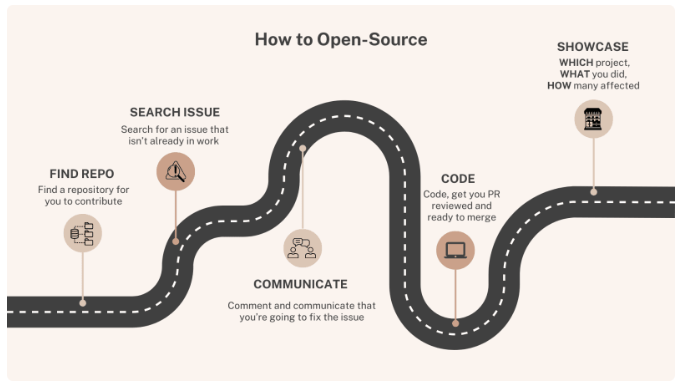

# Contributing to Tech Communities: How Open-Source can land you a job and get you out of the Skill Paradox 💼

[Contributing to Tech Communities: How Open-Source can land you a job and get you out of the Skill Paradox 💼](https://wasp-lang.dev/blog/2023/10/04/contributing-open-source-land-a-job)

October 4, 2023 · 10 min read

Vinny, DevRel @ Wasp

1. Find repo
2. Search for fresh issue
3. Communicate that you're going to fix the issue
4. Code and get your pull request (PR) reviewed and ready to merge
5. Showcase
   1. which project
   2. what you did
   3. how many affected

## 1. Introduction

skill paradox

## 2. First steps on Open-Source Contribution

### 2.1. Finding a project

- actively maintained
- open source license
- medium-sized
- good documentation on how to contribute
  - `CONTRIBUTING.md`
- well-characterized issues

### 2.2. Searching for Issues

Labels

- `good first issue`
- `documentation`

Find an issue not already claimed.

By the way, it's of absolute importance that, when you find an issue, you *comment* and *set yourself as assignee* in order to let other people know that you're going to take the task at hand!

In this case, GitHub is a great platform for us to discuss, but sometimes authors can be hard to find. In these cases, search for a link or a way to contact them directly (in the case of Wasp, they have a Discord server, for example). Communicating your way through is really important to get things sorted out, and if you’re unsure of how to communicate well with people, you can read this other article here and start to get the hang of it

### 3. Guidelines for Contributing to Open-Source Projects

### 3.1. Read the guidelines and write some code

- Pull Request
  - a request to merge your modifications to the codebase

### 3.2 Handling Code Reviews and Feedback

- think of feedback as a gift
- be open to receiving constructive feedback and don't take it personally

Respond to feedback as follows:

1. Thank the person for the feedback
2. Express your opinion (agreement or disagreement) when it makes sense
3. Work on the issue

### 4. Showcasing Contributions

Document all your contributions on different platforms:

- GitHub
- personal portfolio site
- LinkedIn
- other means of reaching people

Considerations

1. What open-source projects have you worked on?
   - Try to think of this as writing a story.
   - First, start by giving the initial context of the project and how it’s revelatory.
2. How did you contribute?
    - Give the context of what you did: documentation, code, and problems you solved in general.
    - Write for your reader and their technical level (reader may not understand something that's too technical).
3. How big was the impact?
   - Talk about how this affected the ecosystem; it can be as big or as small as you like. 
   - Never neglect the impact that changing documentation can have (remember that for us, programmers, the documentation is our source of truth, and fixes there are greatly appreciated).

Utilize the opportunity to engage with other developers and communities, make it so in order to get new connections and even greater opportunities later on!

Case 1 - A big contribution
Case 2- A small contribution

Conclusion
