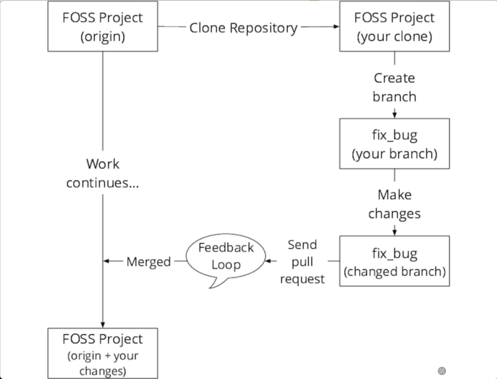
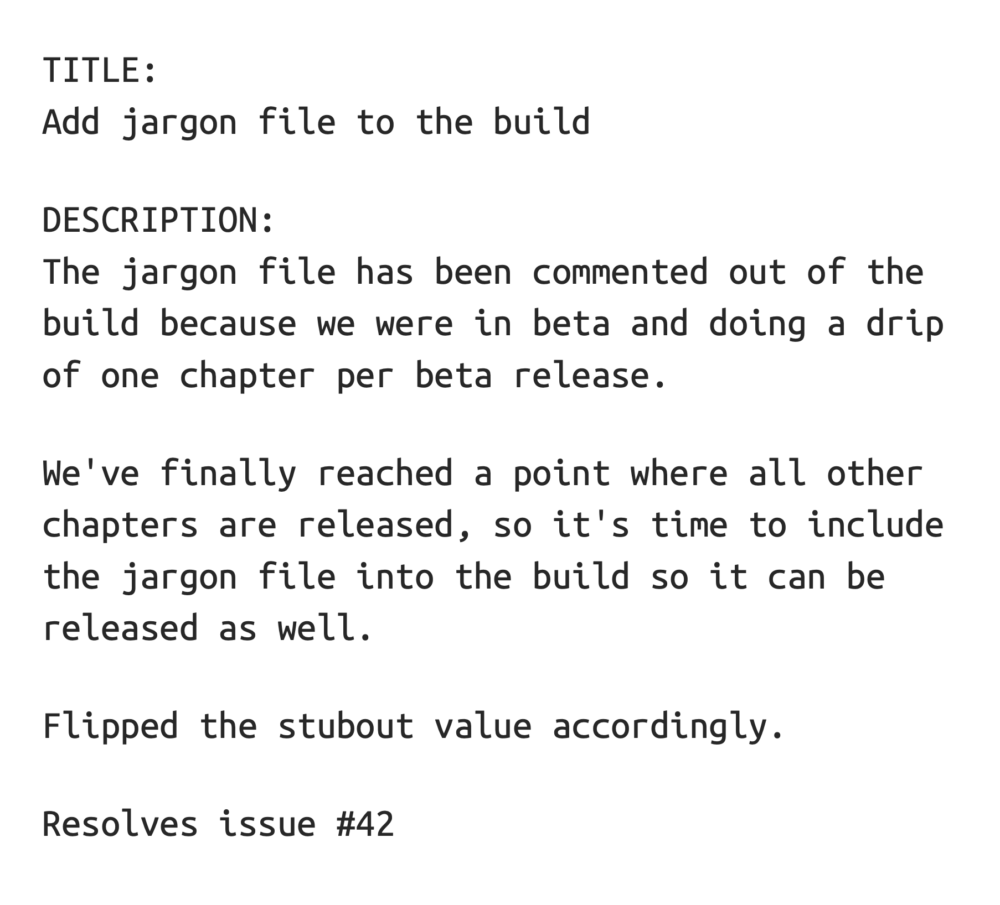

# Forge Your Future with Open Source - Book Notes

## 1. The Foundations and Philosophies of Free and Open Source

## 2. What Free and Open Source Can Do for You

### FOSS Benefits to Your Skillset

#### Communication

#### Collaboration

**Bus Factor** is a number equal to the number of team members who, if run over by a bus, will put the project in jeopardy.

#### Tools

- issue tracking
- version control
  - commit messages
    - provide details of what is changed
    - why it was necessary
    - what problems the commit fixes
- mailing lists

#### Best Practices

learn how best practices work, why they're important and see firsthand the difference they make to a successful software project.

- version control
- feature branches
- unit and integration tests
- continuous integration and deployment (CI/CD)
- design patterns

#### Technologies

- technologies change
- people skills can serve you far better than the technological skills
- The Next Big Thing

### FOSS Benefits to Your Career

FOSS offers you endless options for technologies and architectures. Once you determine your goals, you can turn to FOSS to see which projects will help you reach them.

#### Public Portfolio

- start a log or portfolio for tracking all your contributions
- maintain your own portfolio to track contributions
- maintain your own record of all types of contributions so that you can easily share your contribution portfolio with prospective employers

#### Portfolio as Resume

- portfolio supplements a resume; it does not replace it
- a CV or resume shows prospective employers two things
    1. What you have done for past professional positions and
    2. What difference you've made with those actions
- Prospective employers what someone who made a difference
- resume = what you've done
- portfolio = how you did it
- You need both to share with specific data (numbers)

### FOSS Benefits to Your Personal Network

- Human networking is simply people communicating with other people.
- Communicating while requires practice, intention, and attention.
- "It's not what you know, it's whom you know."
- The most important benefits of these relationships are the discussions, introductions, and information sharing that happens in them.
- More than any technology you will ever use or create, the relationships you foster will help you thrive in your career.
- The relationships formed through contributing to free and open source projects may be the most valuable and lasting benefit.

### Benefit from Preparation

- learn the lay of the land
- know what files and social structures to look for

## 3. Prepare to Contribute

Steps

1. Realize you want to contribute
2. Find a project
3. Find a task (issue)
4. Set up your environment
5. Work on your contribution
6. Submit your contribution
7. Receive feedback and iterate on your contribution
8. Contribution accepted!
9. Goto step 1

### Ways to Contribute

- code, user interface, user experience design, documentation
- testing leads to bug reports
- organizing and managing the entire process


- hardware expertise
- subject matter expertise
  - e.g., strong pedagogical background to write and review lesson plans for an education project

### Common Project and Community Roles


Roles

1. Leadership - Benevolent Dictator For Life (BDFL)
2. Core Contributors
   1. commit bit - authority to approve a contribution
   2. heed the advice and feedback of a core contributor
3. Non-Core Contributors
   1. make regular contributions
   2. can provide advice and mentoring for newer contributors
   3. lifeblood of project
4. New Contributors
   1. apprenticeship phase
   2. projects that pay attention to this role have strong communities which are worth seeking out
5. Users
   1. need people to use the project
   2. provide feedback, bug reports and feature ideas
   3. users the most important layer/role of all because (meet user needs and solve their problems)

Know these most common roles in FOSS to navigate the hierarchy in most projects as you enter the world of FOSS contributing.

### Files You Should Know About Before You Start

Familiarize yourself with what files and features you may see. Not all files mentioned here exist in all projects. Locate most files in the root directory of a project, but not always. Look for a `docs` or similarly named documentation directory.

#### README

- typically first thing you see for a project
- project's face to the world
- make the README file the first stop when visiting any project
- it gives a sense of what the project is about and where to look for more information about the project

#### LICENSE (also COPYING)

- declares the terms under which folks are permitted to use, modify, and distribute the project
- sometimes called `COPYING` particularly for projects that use a version of the GNU Public License (GPL)
- "open source" projects must have an OSI-approved license
- no license means not open source; it is merely "source available"
- `LICENSE` file determines whether a project is open source

#### CONTRIBUTING

- `CONTRIBUTING` file
  - how the project prefers to receive contributions
  - the requirements and parameters a contribution must meet to be accepted into the project

- Apache HTTPD web patches has separate guidelines
  - reporting bugs
  - contributing code
  - contributing documentation

- The Public Speaking Resource project has one file
  - [Public_Speaking](https://github.com/vmbrasseur/Public_Speaking)
  - resources for presenting at technical conferences

- No `CONTRIBUTING` File scenario
  - look at past contributions
  - ask the community for process verification
  - once you have verified the process with the community and made your first contribution, be a community **superhero** by writing it up in the first version of the project's `CONTRIBUTING` file

- Communication is the most important thing (note to myself)

#### Code of Conduct

- Contributor Covenant created by Coraline Ada Ehmke
  - copied into this directory as `contributor-code-of-conduct.md`
  - [Coraline Ada Ehmke](https://where.coraline.codes)

- Code of Conduct (CoC)
  - CoC sign that community wiling to do the right thing
  - enforcement in an effective and empathetic way paramount

#### Styleguides

- Very Strong Opinions
- Always read and follow style guidelines if they exist
- Examples
  - [Google Styleguides](https://github.com/google/styleguide)
  - OpenStack family of projects => IBM
- if no guidelines, not any stylistic preferences the project maintainers express
  - write up the project's stylistic preferences in their very first styleguide and then link to it in the `CONTRIBUTING` file.

#### Other Handy Files

- `INSTALL` or `INSTALLATION` file
  - [`make`](https://www.gnu.org/software/make/)
- `CHANGES` or `CHANGELOG` file
  - use to determine whether the version of the software you're using includes a certain bug fix
  - see the development trajectory of a project
- `AUTHORS` file
  - not as common anymore

### Issue Tracking

- issue tracking, bug tracking, ticketing system - same concept
- uses range
  - bug tracking
  - feature requests
  - support questions
  - design discussions
  - team conversations
  - debates
- always ask the community if you have questions and to verify your assumptions

### Common Communication Routes

1. entirely asynchronous
2. semi-asynchronous
3. synchronous

- Seek out documentation and advice before participating in project discussions.
- Email mailing lists are a common communication method
- real-time chat platforms used as well
  - Internet Relay Chat (IRC)
  - Matrix
  - RocketChat
  - Mattermost
- respect the chosen communication routes used by the project

### Contributor License Agreement (CLA) / Developer Certificate of Origin (DCO)

- Contributor License Agreement (CLA)
  - right to share your contribution
  - agree that the project has a license to alter, distribute, and administer those contributions
  - you agree that you will never revoke that license

- Developer Certificate of Origin (DCO)
  - recently a more popular alternative to CLA
  - DCO relies upon a contributor signing their contribution using the `-s` or `--signoff` flags of the git version control system
    - denotes the right to distribute the contribution under the same conditions as the project license
  - only applies to git projects (not Subversion, CVS, or other systems)

### You're Ready to Find a Project

- equipped with guideposts to navigate FOSS projects
- Find a project and make your first contribution

## 4. Find a Project

- wanting to contribute to a project is the first milestone
- finding the project that's right for you is the second milestone
- take the time to find a project that matches your goals and values.
- defining your goals and requirements and finding the right first project can take some time to do properly, but it's a very good investment.

### Set Your Goals

Why do I want to contribute to open source software?

- goals must be specific and actionable
- collect your thoughts and write them down
  - get a snapshot of your current mind
  - snapshot gives you something to which you can refer later

Brainstorming Session

What do I want to get out of this? Why am I doing this?

1. to get a job as a professional software engineer
2. to learn how software is developed in an actual profitable company
3. to make meaningful connections with other software engineers
4. to find a mentor
5. to make a valuable contribution to a project I love
6. to feel part of a team
7. to get out of toy project hell
8. to bridge the skills gap
9. to contribute to a project that advances human health and fitness

Take the thoughts and organize, consolidate and focus them into a list of goals. Expand on the thoughts until they are specific. Collect similar thoughts together.

What is the why behind every thought? Iteratively refine and collect your thoughts into categories until you've consolidated them into a few core things you would like to achieve by contributing to free and open source software.

Each goal must be specific, concise, and actionable.

My Goals

1. Get an interview at a company where I make an open source contribution.
2. Learn best practices for choosing an issue, making a code contribution, and writing a pull request
3. Practice right speech in communication and collaboration with professional software engineers
4. Master git commands and the GitHub platform for open source software development
5. Find an open source software development mentor
6. Add at least one new piece to my portfolio

Own your goals, take responsibility for meeting them, and you are much more likely to be successful in your FOSS contributions.

Change the goals as necessary.

### Collect Your Requirements

What are your personal requirements for the project you select? What criteria must the project meet to be a good fit for you?

#### Skills

What are your skills? What can you offer to a project?

- great writer or editor
- translation
- graphic design
- user experience specialist
- know certain programming languages
- have experience with electronics
- experience managing people
- writing technical specification or grants
- organizing events

Skills I bring to the party

1. good writer and editor
2. understanding of learning pedagogy
3. advanced JavaScript skills
4. intermediate SQL skills
5. knowledge of scrum/agile/kanban and project management
6. legal background as former litigation lawyer

#### Interests

- domain knowledge

Interests! Hobbies! Curious About!

1. soccer
2. basketball
3. strength training
4. speed training
5. sprinting
6. mobility
7. diet
8. longevity
9. biomarkers
10. reading
11. writing
12. wealth creation
13. family
14. child-raising
15. Buddhism
16. meditation
17. Stoicism
18. Shamanism
19. alternative healing modalities
20. acupuncture
21. dogs
22. nature
23. Korean farmer's band music
24. Bruce Lee

#### Time Availability

- assess how much time you can devote to contributing to a project
- consider that some projects have steeper learning curves

#### Goals

- skills, interests, time availability, and goals = specific requirements
- impermanent and can change over time

### Collect Candidate Projects

- limit the pool of candidates
- start with projects you already use and enjoy
  - Linux user examples
    - Blender, GIMP, KDE, GNOME
  - FOSS Projects are everywhere
    - Drupal, Moodle, Visual Studio Code, iTerm
  - smaller satellite projects such as libraries, plugins, extensions
- inspect your software and its ecosystems for FOSS projects
- Open your favorite web browser, fire up your favorite search engine, and type in an interest name followed by the words "open source" into the search field
- browse popular version control service providers
  - GitHub
  - GitLab
  - BitBucket
- ask network and local community
  - friends
  - social network contacts on Twitter, LinkedIn, etc.

**Invest an hour or two to collect a nice pool of candidate projects and to familiarize yourself with the landscape of free and open source projects that exist in the world.**

#### Candidate Projects List

1. Visual Studio Code
2. freeCodeCamp
3. dev.to
4. GroupSpot
5. Glofox
6. TrainHeroic
7. ATG
8. Forza Football
9. Insight Timer
10. StatSports APEX
11. Garmin
12. Notion
13. Evernote
14. ZebraWeb
15. Node
16. Express
17. OpenSpiel (<https://github.com/deepmind/open_spiel>) - Framework for developing research environments and algorithms for games, including simple soccer game environments. Good option to contribute environments, visualization, or algorithm implementations.
18. Google Research Football (<https://github.com/google-research/football>) - Research project for developing reinforcement learning agents for football/soccer games. Potential areas to contribute include new training scenarios, opponent AI bots, or visualizations. Requires Python/Tensorflow skills.
19. Insight Timer

#### Select a Project

1. Compare the list of projects you've built with your list of requirements.
   1. Of course, matching your requirements is a very important feature for any potential project.
2. Consider how easy it will be for you to contribute
   1. Give yourself the best possible chance for success.
   2. Choose a project that makes contributing more straightforward
   3. Start with an easy win
   4. Increase motivation to continue down the path of contributing elsewhere
3. Look at each project on your list
   1. start with the documentation
      1. `CONTRIBUTING` file to guide people through the contribution process
      2. robust documentation for setting up the developer environment
   2. Communication
      1. communication routes documented and active (people who ask questions receive answers)
   3. Project's issue tracker
      1. Are there any open bugs for features that you think you might be able to tackle?
      2. tags: *Help Wanted*, *First Timers Only*, *Newbie*, *Good First Issue*, *Up for Grabs*

### Select a Task

- You have to decide upon a task.

- If you have a task in mind already, search the project's issue tracker to see whether it exists. Search closed as well as open issues.

- If your idea doesn't exist in the issue tracker, open a new issue.
   1. it notifies the project that a contribution may be on its way
   2. it allows the project maintainers to review the task and confirm that it's something the project needs or wants

- If you don't have a task in mind, check the project's issue tracker
  - sometimes called bug database, or ticketing system
  - look for tags suitable for new contributors
    - easy, starterbug, newbie, help wanted, good first ticket
  - look for task that looks achievable considering your skillset and experience

- Find a suitable task
  - Just Ask works
  - research to familiarize yourself with the project, its needs, and its communication routes
  - introduce yourself
    - new and excited to help
    - briefly state your skills
    - choose an issue or ask for a recommendation
  - start small
    - small tasks lead to quicker payoff with endorphin hit
    - baby steps are still steps
    - simple and repetitive task allow you to contribute quickly, make friends, and influence people in the community
    - show a willingness to dig in and do what it takes to lend a hand and work your way up through the ranks of the community

### What is "Success"?

- You are able to make a first contribution with minimal fuss
- You are welcomed by your first community
- You learn and grow from your experience
- You gain the confidence to help others contribute too

## 5. Make a Contribution

Pause and think through the process and your contribution before you submit it to the project. Basically, FOSS projects have five large parts:

1. Prepare
2. Craft
3. Test
4. Submit
5. Revise

### Prepare for Your Contribution

The more you prepare in advance, the more likely your contribution will be well received.

#### Review the Issue Tracker

Invest some time to review the issue or bug tracker for your chosen project. Picking up tasks that no one else has had time to do can be a great way to make your mark in the community.

#### Set Up Your Environment

- you'll need a testing environment of some sort
- rarely a project might have a container or virtual environment
- if unclear, ask the community for help to setup your testing environment
  - if documentation doesn't exist create the documentation when you setup your testing environment

- **Figure out what sort of testing environment you need for Your specific type of contribution and make sure it works before you lift a finger to start crafting your contribution.**

#### Text Editors

- the text editor you choose can make a big difference when doing software development
- most referenced in FOSS are vi (vim) and emacs
- a good text editor outputs only Unicode or ASCII characters
- You can use an integrated development environment (IDE) like Visual Studio Code, Xcode, or Eclipse

#### Do Issue Triage

- Review the issue to confirm you understand the problem, can duplicate it, and that it's not already fixed elsewhere
- triage allows you to confirm that the issue you select is still an issue
- review the issue for the steps to reproduce the problem, or any other hints about where to look to view the problem itself
- If you are able to reproduce the problem, you have a much better chance of understanding what's going on and where to start looking to solve it.
- As you triage your issue, document all of your discoveries
  - steps to duplicate the issue
  - what you expected to see
  - what you actually did see
  - any additional requirements that aren't listed in the issue
  - add all this to the public note itself
- Documenting your triage notes also helps the next people who look at the issue.

#### Read the Docs (or Write Them)

- follow the project's workflow (as documented in the `CONTRIBUTING` file or elsewhere)
- if workflow is tribal knowledge, ask a community member for advice and guidance
  - write the advice and guidance down for posterity which can also be your first contribution

### Craft Your Contribution

- check project styleguides and contributor instructions
  - code contribution may require unit and/or integration tests
  - code may be required to pass certain linter rules
- always double-check the contribution guidelines before you go too far with your work

### Gotchas

#### Spaces, Tabs, and Tab-size

- project consistency
- programming languages like Python depend on whitespace and proper indentation
- use what is defined by the project and ask the community if unsure

### Clone and Branch

- retrieve a local copy of the repository
  - local copy is known as a `clone`
  - sometimes called a `fork`



- create a branch
  - your work is isolated from every other branch
  - prevents you from sharing changes that you don't want to
  - a branch Is just a named pointer to a certain git commit
  - a branch is just a pointer, not a copy of the repository

- The best practice is to create a new branch of your copy of the repository, and then perform your work on it.
  - this is called using a *feature* or *topic* branch
  - create a branch for just fixing that issue
  - once the issue is complete and the pull request has been accepted, the branch is no longer needed
  - you can then delete the branch

- Here's an example of a new branch created for this chapter of the book:

```sh
Pliny:Book brasseur$ git checkout -b makeacontribution
Switched to a new branch 'makeacontribution'
```

- branches allow for a rigid separation of concerns that prevents committing unneeded or prototype work
- verify the process against the project's `CONTRIBUTING` file

### Atomic Commits

- commit early, commit often
- atomic (tightly scoped) commits are safer commits
  - commits are scoped to a single (usually small) topic, feature, or bug fix
- atomic commits are easier to review afterward and to back out should something go wrong
- An atomic commit is like a paragraph: it's a complete thought. Each time you finish the thought, commit it to the repository.
- if your contribution requires several different steps to complete, make each step a separate, small commit
- some projects want you to use a *squash* or *rebase* feature to consolidate all of those small commits into a single, larger atomic commit, so read and follow the `CONTRIBUTING` file before submitting your contribution to the project.

#### Using version control for non-code contributions

Even if the contribution is not code, it may be submitted via the version control system.

### Test Your Contribution

- After creating your contribution, test it to confirm that it works
- Test the contribution against the appropriate version of the project to make sure it works as expected.
- for code contributions provide both unit and integration tests as well as manually testing yourself
- for documentation, test how your change will appear in the official documentation repository, website, or wherever it may appear.
- if project has CI/CD service pay attention to the results
- if your contribution causes CI/CD to fail (*break the build*), learn from this and fix the problem
- consider documenting your build errors to help others learn from your mistakes

#### Diff Your Work

- before submitting your contribution, always do a `diff` on it.
- `diff` shows the difference between two files
- in git, can use commit hashes two view two versions of the same file
- `+` and `-` lines are the most important part

### Submit Your Contribution

- read the docs for the process to submit based on the type of contribution

#### Read the docs

- `CONTRIBUTING` file or ask the community
- git version control is the most common
  - BitBucket
  - GitLab
  - GitHub

#### Introducing the pull request

- "pull request" comes from the git command `request-pull` and was popularized in its current from by GitHub
- there's one canonical repository in a project which can be called `origin` or `main`
- to have a change in your version of the repository included in the canonical version, you make a *request* for the maintainers of `origin` to *pull* your changes into the canonical repository
- once you submit your pull request, you enter a feedback loop with community members, working with them to refine your contribution. After You have collaborated with them to put the final shine on it, a community member will pull (merge) your contribution into the project.

#### Make the pull request

- the pull request will require some sort of commit message
  - title and description
    - titles should be brief (50 or so characters)
    - descriptions should be as detailed as necessary
      - detail what you changed
      - and why
      - reference the issue number in your description
      - if you format the issue number with a hashtag at the front of it ("#42") then the issue tracking system may automatically link the issue with the pull request
- make your pull request as easy as possible for the reviewer to understand



```sh
“TITLE:​ 
Add jargon file to the build​ ​ 

DESCRIPTION:​ 
The jargon file has been commented out of the​ build because we were in beta and doing a drip​ of one chapter per beta release.​ ​ 

We've finally reached a point where all other​ chapters are released, so it's time to include​ the jargon file into the build so it can be​ released as well.​ ​ 

Flipped the stubout value accordingly.​ ​ 

Resolves issue #42”
```

#### Patch: the other contribution method

- patch files used extensively for many years, so contributions can sometimes still be referred to as "patches".
- “Patch or pull request or passenger pigeon, always know the method for submitting a contribution before you get started.”

### Review, Revise, Collaborate

Before your contribution is merged, it will be reviewed. Collaborate when given feedback. Use atomic commits to your feature branch.

#### Submit work in progress for early feedback

- Sometims it makes sense to send a *work in progress* pull request while you're still creating your contribution. Just put WIP: at the start of your request title.
- This allows you to receive feedback early in the creation process
- higher quality contributions come from receiving early feedback

Here's an example of a work in progress pull request:

```sh
TITLE:
WIP: Testing new section ordering​ ​ 

DESCRIPTION:​ 
I've re-ordered the sections of this chapter in hopes​ they'll flow better. WIP PR so Brian can have a look​ and let me know what he thinks before I go much further​ with the writing.​

For issue #40”
```

#### A Note on feedback

- You are not your contribution
- It's not personal
- Feedback is a gift
- Feedback and questions help make you better at what you do
- If you get angry at some feedback, step away for a bit to cool off before responding
- Always assume good intent

### Tidy Up (Delete Branch)

- delete feature branch right after your pull request is accepted

- Delete local branch example:

```sh
“Pliny:Book brasseur$ git branch -d makeacontribution​ 
Deleted branch makeacontribution (was 74da8bc).”
```

- Delete remote branch example:

```sh
“Pliny:Book brasseur$ git push origin --delete makeacontribution”
```

### Special considerations for windows-base contributors

### There's more to contributing than just code
