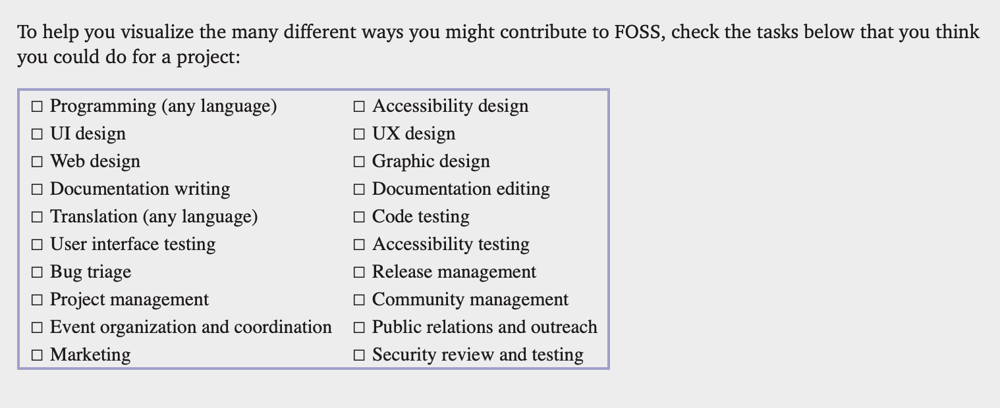
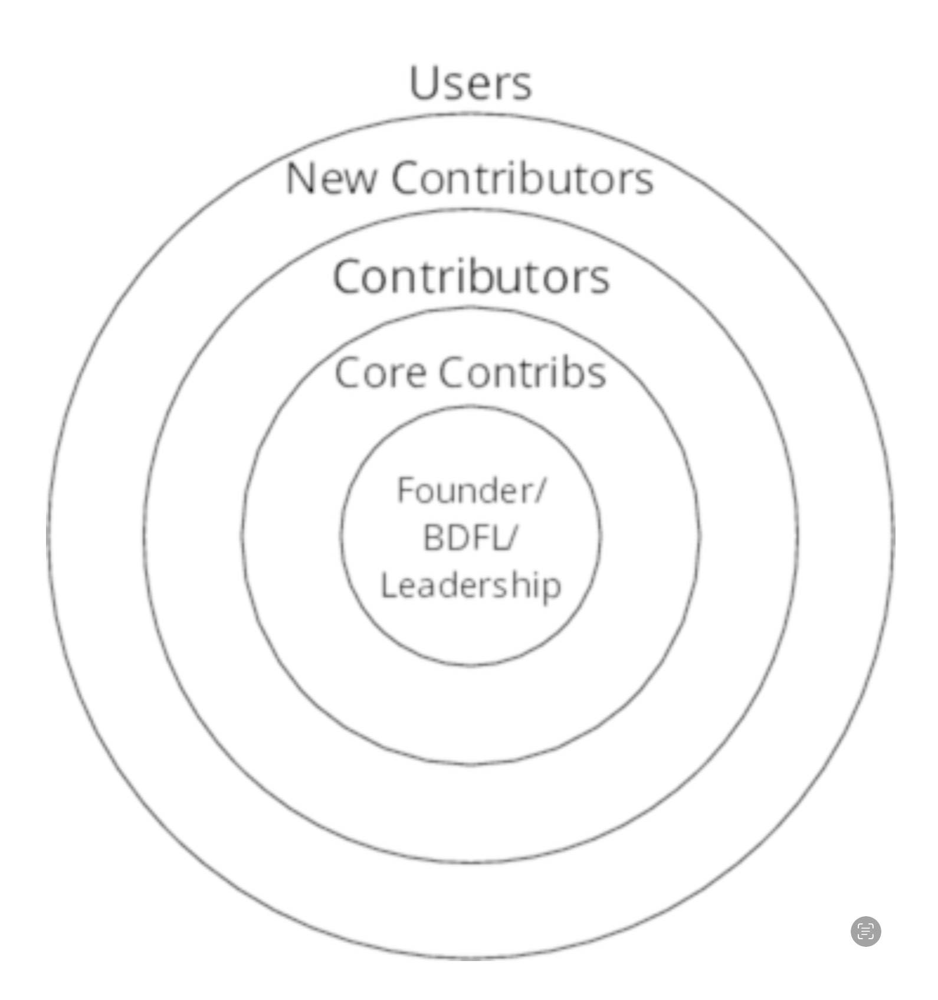

# Forge Your Future with Open Source - Book Notes

## 1. The Foundations and Philosophies of Free and Open Source

## 2. What Free and Open Source Can Do for You

### FOSS Benefits to Your Skillset

#### Communication

#### Collaboration

**Bus Factor** is a number equal to the number of team members who, if run over by a bus, will put the project in jeopardy.

#### Tools

- issue tracking
- version control
  - commit messages
    - provide details of what is changed
    - why it was necessary
    - what problems the commit fixes
- mailing lists

#### Best Practices

learn how best practices work, why they're important and see firsthand the difference they make to a successful software project.

- version control
- feature branches
- unit and integration tests
- continuous integration and deployment (CI/CD)
- design patterns

#### Technologies

- technologies change
- people skills can serve you far better than the technological skills
- The Next Big Thing

### FOSS Benefits to Your Career

FOSS offers you endless options for technologies and architectures. Once you determine your goals, you can turn to FOSS to see which projects will help you reach them.

#### Public Portfolio

- start a log or portfolio for tracking all your contributions
- maintain your own portfolio to track contributions
- maintain your own record of all types of contributions so that you can easily share your contribution portfolio with prospective employers

#### Portfolio as Resume

- portfolio supplements a resume; it does not replace it
- a CV or resume shows prospective employers two things
    1. What you have done for past professional positions and
    2. What difference you've made with those actions
- Prospective employers what someone who made a difference
- resume = what you've done
- portfolio = how you did it
- You need both to share with specific data (numbers)

### FOSS Benefits to Your Personal Network

- Human networking is simply people communicating with other people.
- Communicating while requires practice, intention, and attention.
- "It's not what you know, it's whom you know."
- The most important benefits of these relationships are the discussions, introductions, and information sharing that happens in them.
- More than any technology you will ever use or create, the relationships you foster will help you thrive in your career.
- The relationships formed through contributing to free and open source projects may be the most valuable and lasting benefit.

### Benefit from Preparation

- learn the lay of the land
- know what files and social structures to look for

## 3. Prepare to Contribute

Steps

1. Realize you want to contribute
2. Find a project
3. Find a task (issue)
4. Set up your environment
5. Work on your contribution
6. Submit your contribution
7. Receive feedback and iterate on your contribution
8. Contribution accepted!
9. Goto step 1

### Ways to Contribute

- code, user interface, user experience design, documentation
- testing leads to bug reports
- organizing and managing the entire process

- hardware expertise
- subject matter expertise
  - e.g., strong pedagogical background to write and review lesson plans for an education project

### Common Project and Community Roles

Roles

1. Leadership - Benevolent Dictator For Life (BDFL)
2. Core Contributors
   1. commit bit - authority to approve a contribution
   2. heed the advice and feedback of a core contributor
3. Non-Core Contributors
   1. make regular contributions
   2. can provide advice and mentoring for newer contributors
   3. lifeblood of project
4. New Contributors
   1. apprenticeship phase
   2. projects that pay attentionto this role have strong communities which are worth seeking out
5. Users

### Files You Should Know About Before You Start
### Issue Tracking
### Common Communication Routes
### Contributor License Agreement (CLA) / Developer Certificate of Origin (DCO)
### You're Ready to Find a Project

